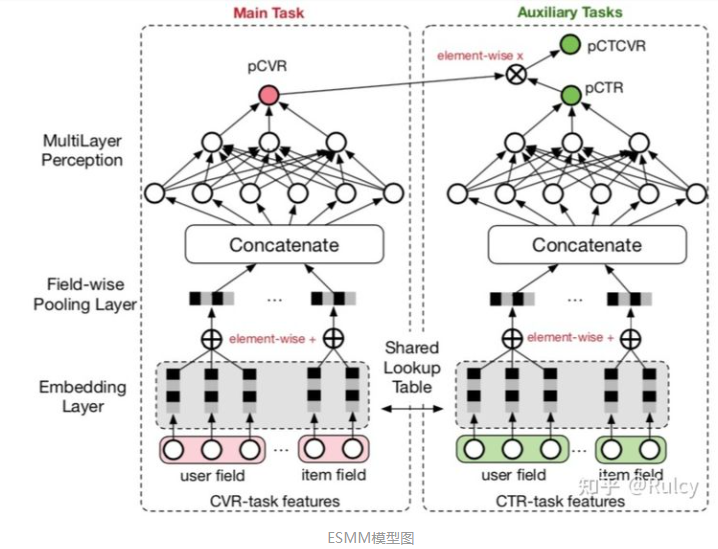
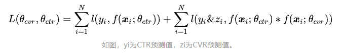
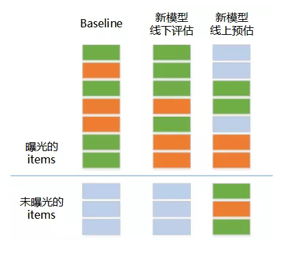
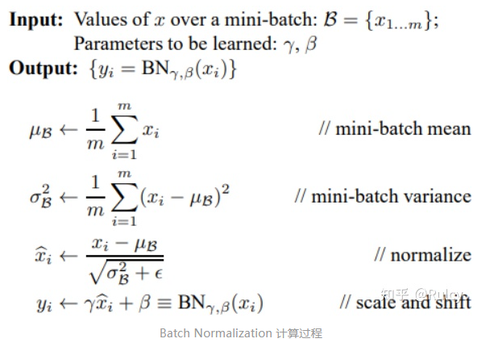
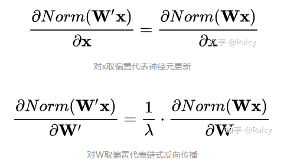
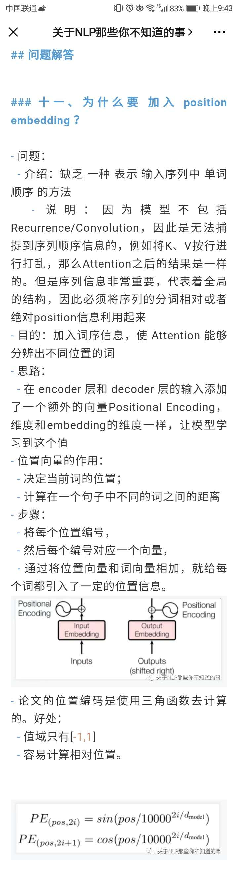

# 推荐系统 百面百搭

> 作者：杨夕、Rulcy、大雨、刘乙己🇻、Stefan、拒绝焦虑李某人、王翔
> 
> 介绍：本项目是作者们根据个人面试和经验总结出的推荐系统(RES) 面试准备的学习笔记与资料，该资料目前包含 推荐各领域的 面试题积累。
> 
> NLP 百面百搭 地址：https://github.com/km1994/NLP-Interview-Notes
> 
> **[手机版NLP百面百搭](https://mp.weixin.qq.com/s?__biz=MzAxMTU5Njg4NQ==&mid=100005719&idx=3&sn=5d8e62993e5ecd4582703684c0d12e44&chksm=1bbff26d2cc87b7bf2504a8a4cafc60919d722b6e9acbcee81a626924d80f53a49301df9bd97&scene=18#wechat_redirect)**
> 
> 推荐系统 百面百搭 地址：https://github.com/km1994/RES-Interview-Notes
> 
> **[手机版推荐系统百面百搭](https://mp.weixin.qq.com/s/b_KBT6rUw09cLGRHV_EUtw)**
> 
> 搜索引擎 百面百搭 地址：https://github.com/km1994/search-engine-Interview-Notes 【编写ing】
> 
> NLP论文学习笔记：https://github.com/km1994/nlp_paper_study
> 
> 推荐系统论文学习笔记：https://github.com/km1994/RS_paper_study
> 
> GCN 论文学习笔记：https://github.com/km1994/GCN_study


> **关注公众号 【关于NLP那些你不知道的事】 加入 【NLP && 推荐学习群】一起学习！！！**

> 注：github 网页版 看起来不舒服，可以看 **[手机版推荐系统百面百搭](https://mp.weixin.qq.com/s/b_KBT6rUw09cLGRHV_EUtw)**

- [推荐系统 百面百搭](#推荐系统-百面百搭)
  - [一、【关于 推荐系统 导论篇】 那些你不知道的事](#一关于-推荐系统-导论篇-那些你不知道的事)
  - [二、推荐系统机器学习篇](#二推荐系统机器学习篇)
    - [2.1 【关于 协同过滤篇】那些你不知道的事](#21-关于-协同过滤篇那些你不知道的事)
    - [2.2【关于 矩阵分解篇】那些你不知道的事](#22关于-矩阵分解篇那些你不知道的事)
    - [2.3 【关于 逻辑回归篇】 那些你不知道的事](#23-关于-逻辑回归篇-那些你不知道的事)
    - [2.4 【关于POLY2篇】那些你不知道的事](#24-关于poly2篇那些你不知道的事)
    - [2.5 【关于FM篇】那些你不知道的事](#25-关于fm篇那些你不知道的事)
    - [2.6 【关于FFM篇】那些你不知道的事](#26-关于ffm篇那些你不知道的事)
    - [2.7 【关于GBDT+LR篇】那些你不知道的事](#27-关于gbdtlr篇那些你不知道的事)
    - [2.8 LS-PLM 算法篇](#28-ls-plm-算法篇)
  - [三、推荐系统 深度学习篇](#三推荐系统-深度学习篇)
    - [3.1 AutoRec 篇](#31-autorec-篇)
    - [3.2 NeuralCF模型 篇](#32-neuralcf模型-篇)
    - [3.3 Deep Crossing模型 篇](#33-deep-crossing模型-篇)
    - [3.4 PNN 模型 篇](#34-pnn-模型-篇)
    - [3.5 Wide＆Deep模型 篇](#35-widedeep模型-篇)
    - [3.6 FM与深度学习模型的结合 篇](#36-fm与深度学习模型的结合-篇)
    - [3.7 注意力机制在推荐模型中的应用篇](#37-注意力机制在推荐模型中的应用篇)
    - [3.8 DIEN 篇](#38-dien-篇)
  - [四、推荐系统 落地篇](#四推荐系统-落地篇)
  - [五、多角度审视推荐系统篇](#五多角度审视推荐系统篇)
  - [六、推荐系统 评估方法篇](#六推荐系统-评估方法篇)
  - [七、推荐系统 工程落地篇](#七推荐系统-工程落地篇)
  - [广告算法（系统）、推荐算法（系统）、 搜索算法（系统）](#广告算法系统推荐算法系统-搜索算法系统)
    - [协同过滤，优缺点。](#协同过滤优缺点)
    - [UserCF、ItemCF，应用场景。](#usercfitemcf应用场景)
    - [ctr和cvr模型有什么不同。简介ESMM模型。](#ctr和cvr模型有什么不同简介esmm模型)
    - [用户/项目相似度衡量指标，特征相关性衡量指标。](#用户项目相似度衡量指标特征相关性衡量指标)
    - [ROC曲线是怎么画的？](#roc曲线是怎么画的)
    - [Softmax上溢、下溢。](#softmax上溢下溢)
    - [LR中连续特征为什么要做离散化？](#lr中连续特征为什么要做离散化)
    - [LSTM输入的维度是100，隐状态的维度是50，问总共的参数量是多少？](#lstm输入的维度是100隐状态的维度是50问总共的参数量是多少)
    - [简述fm和矩阵分解模型思想上的的异同点。](#简述fm和矩阵分解模型思想上的的异同点)
    - [如何挖掘情感极性词典？](#如何挖掘情感极性词典)
    - [问题：业界推荐系统中如何根据应用场景选取负样本？](#问题业界推荐系统中如何根据应用场景选取负样本)
    - [问题：推荐系统如何解决重复推荐用户刚刚行为过的item的问题？](#问题推荐系统如何解决重复推荐用户刚刚行为过的item的问题)
    - [问题：WIDEand deep 哪类输入wide，哪类输入deep](#问题wideand-deep-哪类输入wide哪类输入deep)
    - [问题：视频推荐遇到之前推过的视频咋处理?（视频推荐）](#问题视频推荐遇到之前推过的视频咋处理视频推荐)
    - [问题：推荐系统健康度问题？ 【注：参考：时晴 炼丹笔记：推荐系统里的那些坑儿】](#问题推荐系统健康度问题-注参考时晴-炼丹笔记推荐系统里的那些坑儿)
    - [问题：评估指标里问题？ 【注：参考：时晴 炼丹笔记：推荐系统里的那些坑儿】](#问题评估指标里问题-注参考时晴-炼丹笔记推荐系统里的那些坑儿)
    - [问题：线上线下不一致问题？ 【注：参考：时晴 炼丹笔记：推荐系统里的那些坑儿】](#问题线上线下不一致问题-注参考时晴-炼丹笔记推荐系统里的那些坑儿)
      - [1. 特征不一致](#1-特征不一致)
      - [2. 数据分布不一致](#2-数据分布不一致)
    - [AUC是如何实现的，它对正负样本采样是否敏感？](#auc是如何实现的它对正负样本采样是否敏感)
    - [推荐模型——LS-PLM基于机器学习算法的推荐。（可供扩展：说说你知道的推荐模型）](#推荐模型ls-plm基于机器学习算法的推荐可供扩展说说你知道的推荐模型)
    - [推荐模型——Airbnb基于Embedding的实时搜索推荐系统。（一种经典的embedding相似度召回模型）](#推荐模型airbnb基于embedding的实时搜索推荐系统一种经典的embedding相似度召回模型)
    - [如何解决推荐系统重复推荐用户已经处理过的item的问题？](#如何解决推荐系统重复推荐用户已经处理过的item的问题)
    - [推荐系统召回阶段如何实现热门item的打压？（推荐中的“哈利波特”效应）](#推荐系统召回阶段如何实现热门item的打压推荐中的哈利波特效应)
    - [关于推荐系统的召回模型。](#关于推荐系统的召回模型)
    - [user/item冷启动怎么解决？](#useritem冷启动怎么解决)
    - [推荐系统中常见的Embedding方法有哪些？](#推荐系统中常见的embedding方法有哪些)
    - [简述Embedding与推荐系统的结合。](#简述embedding与推荐系统的结合)
    - [介绍FM和FFM。](#介绍fm和ffm)
    - [介绍FNN。](#介绍fnn)
    - [特征筛选方法。](#特征筛选方法)
    - [推荐系统的特征工程有哪些？怎么做？](#推荐系统的特征工程有哪些怎么做)
    - [如何解决数据不平衡？](#如何解决数据不平衡)
    - [假设检验的两类错误。](#假设检验的两类错误)
    - [RMSE、MSE、MAE。](#rmsemsemae)
    - [双塔模型的应用](#双塔模型的应用)
    - [多路召回的作用？](#多路召回的作用)
    - [召回模型中，评价指标怎么设定？](#召回模型中评价指标怎么设定)
    - [广告算法（系统）、推荐算法（系统）、搜索算法（系统）有什么异同？](#广告算法系统推荐算法系统搜索算法系统有什么异同)
    - [线下提升线上效果不好](#线下提升线上效果不好)
    - [问题四：什么情况下使用动量优化器？（机器学习）<a name='问题四什么情况下使用动量优化器-机器学习'></a>](#问题四什么情况下使用动量优化器机器学习)
    - [问题三：怎么衡量两个分布的差异，熵、KL散度和交叉熵损失有什么不同，关系是什么 (机器学习/自然语言处理)](#问题三怎么衡量两个分布的差异熵kl散度和交叉熵损失有什么不同关系是什么-机器学习自然语言处理)
    - [问题二：w&d模型的特征，哪些放到wide侧，哪些放到deep侧？ w&d模型在线上，如何做到根据实时数据更新模型（推荐）](#问题二wd模型的特征哪些放到wide侧哪些放到deep侧-wd模型在线上如何做到根据实时数据更新模型推荐)
    - [问题一：召回模型中，模型评价指标怎么设计？（推荐）](#问题一召回模型中模型评价指标怎么设计推荐)
    - [](#)
  - [机器学习基础](#机器学习基础)
    - [附：前言问题。（调参、Dropout、过拟合）](#附前言问题调参dropout过拟合)
    - [分类决策树的指标有哪些？](#分类决策树的指标有哪些)
    - [决策树怎么构造？](#决策树怎么构造)
    - [交叉熵的意义。（为什么要用交叉熵？而不用MSE？）](#交叉熵的意义为什么要用交叉熵而不用mse)
    - [Batch Normalization](#batch-normalization)
    - [FTRL是什么？](#ftrl是什么)
    - [梯度下降方法](#梯度下降方法)
    - [损失函数无法求导该怎么样进行优化？](#损失函数无法求导该怎么样进行优化)
    - [Batch Normalization 相关问题](#batch-normalization-相关问题)
    - [逻辑斯蒂回归（LR, Logistic Regression)是什么、怎么推导？](#逻辑斯蒂回归lr-logistic-regression是什么怎么推导)
    - [交叉熵与softmax 是 什么？有什么区别？](#交叉熵与softmax-是-什么有什么区别)
    - [交激活函数 是 什么？有什么作用？](#交激活函数-是-什么有什么作用)
    - [泛化误差（过拟合） 问题？](#泛化误差过拟合-问题)
    - [SVM 是什么、怎么推导？](#svm-是什么怎么推导)
    - [约束优化问题的对偶问题](#约束优化问题的对偶问题)
    - [Dropout 是什么？](#dropout-是什么)
    - [评价指标？](#评价指标)
    - [正则化L1,L2？](#正则化l1l2)
    - [权重初始化？](#权重初始化)
    - [决策树是什么、怎么推导？](#决策树是什么怎么推导)
    - [优化算是什么？](#优化算是什么)
    - [线性判别分析是什么？](#线性判别分析是什么)
    - [KMeans是什么？](#kmeans是什么)
    - [牛顿法 是什么？](#牛顿法-是什么)
    - [缺失值的处理？](#缺失值的处理)
    - [模型评估中常用的验证方法](#模型评估中常用的验证方法)
    - [主成分分析](#主成分分析)
    - [Softmax函数的特点和作用是什么](#softmax函数的特点和作用是什么)
    - [样本不均衡是什么](#样本不均衡是什么)
    - [损失函数](#损失函数)
    - [贝叶斯决策论](#贝叶斯决策论)
    - [采样](#采样)
  - [集成学习](#集成学习)
    - [XGBoost如果损失函数没有二阶导，该怎么办？](#xgboost如果损失函数没有二阶导该怎么办)
    - [Boosting vs Bagging？](#boosting-vs-bagging)
    - [梯度提升决策树GBDT/MART (Gradient Boosting Decision Tree)是什么？](#梯度提升决策树gbdtmart-gradient-boosting-decision-tree是什么)
    - [XGBoost和GBDT是什么？有什么区别？](#xgboost和gbdt是什么有什么区别)
    - [XGBoost和GBDT是什么？有什么区别？](#xgboost和gbdt是什么有什么区别-1)
    - [LightGBM是什么？](#lightgbm是什么)
    - [AdaBoost思想？](#adaboost思想)
  - [深度学习基础](#深度学习基础)
    - [VGG使用使用3*3卷积核的优势是什么？](#vgg使用使用33卷积核的优势是什么)
    - [卷积是什么、怎么推导？](#卷积是什么怎么推导)
    - [pooling有什么意义，和卷积有什么区别](#pooling有什么意义和卷积有什么区别)
  - [自然语言处理](#自然语言处理)
    - [Transformer细节：Scaled Dot-Product Attention为什么要缩放？（两点）Position Embedding是如何实现的？](#transformer细节scaled-dot-product-attention为什么要缩放两点position-embedding是如何实现的)
    - [Skip-grim和Cbow的区别？Skip-grim优势在哪？](#skip-grim和cbow的区别skip-grim优势在哪)
    - [Word2Vec常见的加速训练的方式有哪些？](#word2vec常见的加速训练的方式有哪些)
  - [问题：Transformer的位置编码公式(自然语言处理)](#问题transformer的位置编码公式自然语言处理)
  - [问题：MSE为什么不能作为分类任务的损失函数，sigmoid与softmax分类有什么优缺点？(自然语言处理)](#问题mse为什么不能作为分类任务的损失函数sigmoid与softmax分类有什么优缺点自然语言处理)
  - [问题：NER任务BIO标签分布不均衡，该怎么进行优化](#问题ner任务bio标签分布不均衡该怎么进行优化)
  - [问题：怎么决定哪些query走字典匹配，哪些走深度模型？](#问题怎么决定哪些query走字典匹配哪些走深度模型)
  - [问题：检索可以用语义检索，精排也是语义吗，模型层面，检索和精排有什么异同](#问题检索可以用语义检索精排也是语义吗模型层面检索和精排有什么异同)
  - [问题：做NER的时候，BERT之上还需要 BiLSTM 吗？ (自然语言处理)](#问题做ner的时候bert之上还需要-bilstm-吗-自然语言处理)
  - [问题：问一下ner标注错误的话有没有啥好的办法检测，修正 (自然语言处理)](#问题问一下ner标注错误的话有没有啥好的办法检测修正-自然语言处理)
  - [问题十：LSTM为什么能解决梯度消失和梯度爆炸(自然语言处理)](#问题十lstm为什么能解决梯度消失和梯度爆炸自然语言处理)
  - [问题九：xgb怎么处理缺省值](#问题九xgb怎么处理缺省值)
  - [问题八：怎么处理未登录词问题](#问题八怎么处理未登录词问题)
  - [问题七：对于生僻词，skip-gram和cbow哪个效果更好？原因是什么？(自然语言处理)](#问题七对于生僻词skip-gram和cbow哪个效果更好原因是什么自然语言处理)
  - [问题六：超过1000个字符长度的文本分类问题如何解决？(自然语言处理)](#问题六超过1000个字符长度的文本分类问题如何解决自然语言处理)
  - [问题五：dropout 和L1 和l2是什么关系，有什么异同? (深度学习)](#问题五dropout-和l1-和l2是什么关系有什么异同-深度学习)
    - [](#-1)
  - [Trick](#trick)
    - [问题：tensorflow2.0 model.predict内存不断增长，怎么优化（tensorflow优化）](#问题tensorflow20-modelpredict内存不断增长怎么优化tensorflow优化)
    - [常用的超参数调优方法有哪些？](#常用的超参数调优方法有哪些)
    - [Tensorflow与PyTorch的区别。](#tensorflow与pytorch的区别)
    - [问题：其他坑总结 【注：参考：时晴 炼丹笔记：推荐系统里的那些坑儿】](#问题其他坑总结-注参考时晴-炼丹笔记推荐系统里的那些坑儿)
  - [问题：工程里的一些坑？ 【注：参考：时晴 炼丹笔记：推荐系统里的那些坑儿】](#问题工程里的一些坑-注参考时晴-炼丹笔记推荐系统里的那些坑儿)
    - [模型工程](#模型工程)
    - [系统工程](#系统工程)
  - [参考](#参考)

## [一、【关于 推荐系统 导论篇】 那些你不知道的事](introduction/)

- 1.1 什么是推荐系统？
- 1.2 推荐系统的作用？
- 1.3 推荐系统的意义？
- 1.4 推荐系统要解决的问题？
- 1.5 常用的推荐系统的逻辑框架是怎么样的呢？
- 1.6 常用的推荐系统的技术架构是怎么样的呢？
- 1.7 推荐系统算法工程师日常解决问题？
- 1.8 推荐系统算法工程师 处理的数据部分有哪些，最后得到什么数据？
- 1.9 推荐系统算法工程师 处理的模型部分有哪些，最后得到什么数据？
- 1.10 模型训练的方式？
- 1.11 推荐系统 的 流程是什么？
- 1.12 推荐系统 的 流程是什么？
- 1.13 推荐系统 与 搜索、广告 的 异同？
- 1.14 推荐系统 整体架构？

## [二、推荐系统机器学习篇](traditional_recommendation_model/)

### [2.1 【关于 协同过滤篇】那些你不知道的事](traditional_recommendation_model/collaborative_filtering/)

- 一、基础篇
  - 1.1 什么是协同过滤？
  - 1.2 协同过滤的推荐流程是怎么样？
- 二、基于用户的协同过滤 （User-CF-Based）篇
  - 2.1 基于用户的协同过滤 （User-CF-Based） 是什么？
  - 2.2 基于用户的协同过滤 （User-CF-Based） 的思想是什么？
  - 2.3 基于用户的协同过滤 （User-CF-Based） 的特点是什么？
- 三、基于物品的协同过滤 （Item-CF-Based）篇
  - 3.1 基于物品的协同过滤 （Item-CF-Based） 是什么？
  - 3.2 基于物品的协同过滤 （Item-CF-Based） 的思想是什么？
  - 3.3 基于物品的协同过滤 （Item-CF-Based） 的特点是什么？
  - 3.4 基于物品的协同过滤 （Item-CF-Based） 的具体步骤是什么？
- 四、User-CF-Based 与 Item-CF-Based 对比篇
  - 4.1 User-CF-Based 与 Item-CF-Based 的应用场景的区别
  - 4.2 User-CF-Based 与 Item-CF-Based 的存在问题的区别
- 五、User-CF-Based 与 Item-CF-Based 问题篇


### [2.2【关于 矩阵分解篇】那些你不知道的事](traditional_recommendation_model/matrix_factorization/)

- 一、动机篇
  - 1.1 为什么 需要 矩阵分解？
- 二、隐语义模型 介绍篇
  - 2.1 什么是 隐语义模型？
  - 2.2 隐语义模型 存在什么问题？
- 三、矩阵分解 介绍篇
  - 3.1 如何 获取 ⽤户矩阵Q 和 音乐矩阵P？
  - 3.2 矩阵分解 思路 是什么？
  - 3.3 矩阵分解 原理 是什么？
  - 3.4 如何 利用 矩阵分解 计算 用户 u 对 物品 v 的 评分？
- 四、矩阵分解 优缺点篇
  - 4.1 矩阵分解 存在什么问题？

### [2.3 【关于 逻辑回归篇】 那些你不知道的事](traditional_recommendation_model/logistic_regression/)

- 一、动机篇
  - 1.1 为什么 需要 逻辑回归？
- 二、逻辑回归 介绍篇
  - 2.1 逻辑回归 如何解决 上述问题？
  - 2.2 什么是逻辑回归
- 三、逻辑回归 推导篇
  - 3.1 逻辑回归 如何推导？
  - 3.2 逻辑回归 如何求解优化？
- 四、逻辑回归 推荐流程篇
  - 4.1 逻辑回归 推荐流程？
- 五、逻辑回归 优缺点篇
  - 5.1 逻辑回归 有哪些优点？
  - 5.2 逻辑回归 有哪些缺点？

### [2.4 【关于POLY2篇】那些你不知道的事](traditional_recommendation_model/POLY2/)

- 一、为什么要使用 POLY2？
- 二、POLY2 的思路是什么？
- 三、POLY2 存在什么问题？
  
### [2.5 【关于FM篇】那些你不知道的事](traditional_recommendation_model/FM/)

- 一、为什么要使用 FM？
- 二、FM 的思路是什么？
- 三、FM 的优点？
- 四、FM 的缺点？
- 五、POLY2 vs FM？

### [2.6 【关于FFM篇】那些你不知道的事](traditional_recommendation_model/FFM/)

- 一、为什么要使用 FFM？
- 二、FFM 的思路是什么？
- 三、FM vs FFM？

### [2.7 【关于GBDT+LR篇】那些你不知道的事](traditional_recommendation_model/GBDT_LR/)

- 一、动机篇
  - 1.1 为什么 需要 GBDT+LR？
- 二、GBDT 介绍篇
  - 2.1 GBDT 的基础结构是什么样的？
  - 2.2 GBDT 的学习方式？
  - 2.3 GBDT 的思路？
  - 2.4 GBDT 的特点是怎么样？
  - 2.5 GBDT 所用分类器是什么？
  - 2.6 GBDT 解决二分类和回归问题的方式？
  - 2.7 GBDT 损失函数 是什么？
  - 2.8 构建分类GBDT的步骤 是什么？
  - 2.9 GBDT 优缺点篇？
- 三、GBDT+LR 模型介绍篇
  - 3.1 GBDT+LR 模型 思路是什么样？
  - 3.2 GBDT+LR 模型 步骤是什么样？
  - 3.3 GBDT+LR 模型 关键点是什么样？
  - 3.4 GBDT+LR 模型 本质是什么样？
- 四、GBDT+LR 优缺点篇
  - 4.1 GBDT+LR 的优点是什么？
  - 4.2 GBDT+LR 的缺点是什么？

### 2.8 LS-PLM 算法篇

## 三、推荐系统 深度学习篇

### 3.1 AutoRec 篇

### 3.2 NeuralCF模型 篇

### 3.3 Deep Crossing模型 篇

### 3.4 PNN 模型 篇

### 3.5 Wide＆Deep模型 篇

### 3.6 FM与深度学习模型的结合 篇

### 3.7 注意力机制在推荐模型中的应用篇

### 3.8 DIEN 篇

## 四、推荐系统 落地篇

## 五、多角度审视推荐系统篇

## 六、推荐系统 评估方法篇

## 七、推荐系统 工程落地篇

## 广告算法（系统）、推荐算法（系统）、 搜索算法（系统）

### 协同过滤，优缺点。

> 参考：https://zhuanlan.zhihu.com/p/420346637

A: 协同过滤即是通过（不同用户/物品）合作，实现信息的过滤（即筛选），是一个简单且可解释性强的方案。最常见的协同过滤的方法有UserCF和ItemCF，可以发现早期协同过滤的方法使热门的物品（或用户）具备很强的头部效应，使所有物品都与它有较大的相似度。这揭示了这一方法的天然缺陷，即对于稀疏的数据处理能力弱。

### UserCF、ItemCF，应用场景。

> 参考：https://zhuanlan.zhihu.com/p/420346637

A: UserCF：得到共现矩阵，根据共现矩阵得到所有用户两两之间的相似度，对User i取TopN个相似用户，对这TopN个用户的项目评分取加权平均，作为该用户预测评分结果。

- 优点：简单易用，复合直觉“兴趣相似的人喜欢的东西相似”。
- 缺点：用户的历史数据稀疏，找到相似用户的准确度并不是很高。UserCF不适用于正反馈较难获取的应用场景。另一方面，用户的增长是远大于Item的增长的，从这个角度来看，UserCF带来的存储压力更大。

ItemCF：得到共现矩阵，根据共现矩阵得到所有物品两两之间的相似度，对User i取正反馈物品列表，根据相似度计算出相似的TopK个物品作为推荐列表。

- 优点：物品相似度存储压力远小于用户相似度。复合直觉“用户喜欢某物品，应推荐相似物品”。
- 缺点：头部效应严重，同样不适用于处理稀疏数据。
- 应用场景：UserCF更适用于新闻推荐，用户能快速得知与自己兴趣相似的人最近喜欢什么，从而更趋向于新闻的及时性、热点性。ItemCF更适用于兴趣在短时间内变化较为稳定的场景，如电商推荐，用户倾向于在短时间内寻找一类商品，此时利用物品相似度时更符合用户动机的。由于UserCF与ItemCF这两种不同的特性，可以作为多路召回策略。

###  ctr和cvr模型有什么不同。简介ESMM模型。

> 参考：https://zhuanlan.zhihu.com/p/420346637

A: 样本空间不同，举例理解：CTR输入是召回Item，输出为点击率。CVR输入是点击的Item，输出为转化率。



在ESMM模型中，业务目标为推荐物品后的转化率（收益），所以模型采用CTR×CVR=CTCVR作为线下指标。故采用了共享Embedding层的两个模块设计了一个多任务学习的框架——ESMM。ESMM的两个模块分别输出CTR与CVR并共同训练，最终输出为CTCVR（CTR×CVR），从而避免了割裂曝光->点击->转化的这一整个流程，且使整个模型的训练在同一个样本空间。

ESMM的精华在于：1）CTR和CVR模块共享Embedding层（多任务学习）。2）隐式地学习CVR模块，通过下面的公式可知，CTR的参数可以单独通过点击率数据（CTR监督数据）学习，而CVR是通过CTCVR监督信息来学习的（与CTR一起学习）。



### 用户/项目相似度衡量指标，特征相关性衡量指标。

> 参考：https://zhuanlan.zhihu.com/p/420346637

A: 相似度：余弦相似度、皮尔逊相关系数（消除了单个用户均分所带来的偏置——有人3分代表喜欢，有人3分代表讨厌），相似的，在衡量相似度时同样可以减去物品的均分，从而消除物品带来的偏置。

相关性：皮尔逊相关系数（线性）、卡方验证、互信息、距离相关系数等等。

需要注意，余弦相似度不能衡量相关性，举例来说两个向量（向量值只有0和1）X与!X，可知他们的余弦相似度为0，但相关性是很高的。方差用于特征筛选可以衡量单个特征发散性，不能衡量特征之间的相关性。

### ROC曲线是怎么画的？

> 参考：https://zhuanlan.zhihu.com/p/420346637

A: ROC曲线的绘制方法为调整截断点，即对于二分类任务，每个样本输出一个0~1的值作为判断正/负样本的概率。在绘制ROC曲线中，从0~1逐步调整正负样本划分的阈值，每次调整记录下来假阳性率和真阳性率。越接近0/1的输出越能以较大概率判断为负/正样本，而在常规情况下，我们采用阈值0.5作为二分类标准。


### Softmax上溢、下溢。

> 参考：https://zhuanlan.zhihu.com/p/420346637

A: 上溢：x过大，指数形式导致计算超出存储范围。下溢：x过小，导致分母接近0，计算结果出现Nan。

解决方案：对x进行变换使x = x-Max(x)，此时分母至少为1。解释如下图所示。


### LR中连续特征为什么要做离散化？

> 参考：https://zhuanlan.zhihu.com/p/420346637

A: 工业界很少将连续特征作为LR的输入，而采用离散化后的特征作为输入，原因如下：

1. 数据角度：离散化的特征对异常数据有很强的鲁棒性；离散化特征利于进行特征交叉。
2. 模型角度：当数据增加/减少时，利于模型快速迭代；离散化相当于为模型引入非线性表达；离散化特征简化了模型输入，降低过拟合风险；LR中离散化特征很容易根据权重找出bad case。
3. 计算角度：稀疏向量内积计算速度快。（在计算稀疏矩阵内积时，可以根据当前值是否为0来直接输出0值，这相对于乘法计算是快很多的。）

而离散化连续值特征后同样会带来一些缺点，如下：

1. 不合理的区间划分容易降低模型表达能力，构造合理的区间划分同样比较困难（需要从区间数、区间分段大小、区间内样本分布进行权衡）。
2. 如果连续特征x对y有着很强的先验知识（如强线性关系），离散化后会使x的信息表达能力损失。

### LSTM输入的维度是100，隐状态的维度是50，问总共的参数量是多少？

((100+50)*50+50)*4 = 30200

### 简述fm和矩阵分解模型思想上的的异同点。

曾伟:

简述fm和矩阵分解模型思想上的的异同点。

- MF 是用use和item 的特征隐向量表示user 和 item 的特征，进而做相似度计算，用于item召回。
- FM 是用因子分解机来做特征的二阶交叉，进而预测user 和 item 的ctr概率，可用于召回或者排序阶段。

1. 相同点：MF可以理解为一种特殊的FM，即只有 uid 和 iid 的 FM模型，MF将这两类特征通过矩阵分解来达到 embedding 的目的。
2. 区别：FM使用了id 之外的特征，同时FM还做了矩阵积的优化，复杂度大幅降低。


### 如何挖掘情感极性词典？

1. tfidf
2. 互信息
3. lda
4. 决策树结合信息增益

### 问题：业界推荐系统中如何根据应用场景选取负样本？

-参考地址：https://www.zhihu.com/question/29438231

### 问题：推荐系统如何解决重复推荐用户刚刚行为过的item的问题？

-参考地址：https://www.zhihu.com/question/345071035

### 问题：WIDEand deep 哪类输入wide，哪类输入deep

```s
Lyo:
一般wide和deep都是接收所有数据的输入吧，二者的区别是wide部分属于特征的线性交叉，deep部分属于非线性交叉

AI曾小健_顺义_中华复兴:
比方说哪类数据，用户坐标，性别，

Lyo:
你是说稀疏数据或稠密数据吗

麻木的程序猿:
wide是输入稀疏的类别性数据和一些类别数据的组合

AI曾小健_顺义_中华复兴:
deep呢

麻木的程序猿:
wide&deep文章里，是将用户被推荐的app id和下载的app id喂给wide

麻木的程序猿:
deep就是各种属性特征

AI曾小健_顺义_中华复兴:
推荐系统中的aUC是如何计算的？

麻木的程序猿:
一个是计算面积，还有一个是正样本rank和减去正样本组合数再除正负样本乘积
```

### 问题：视频推荐遇到之前推过的视频咋处理?（视频推荐）

```s
大雨:
feed流的短视频咋办呢?有段时间刷抖音，一帮人抬着一块玻璃吓唬人的视频反复给我推(可能不是一个问题，是不同号的相同视频)

王翔:
这东西过滤不就好了，或者如果场景有重定向的或者其他规则，再透出就好了

王翔:
这不就黄赌毒一个道理吗，模型会推，你就不会过滤吗

大雨:
需不需要区分处理?如果某个短视频给了很好的正反馈和一划而过那种

王翔:
怎么加和怎么过就是业务的问题

大雨:
不知道一般实际做得时候大多人工拍一个过滤规则还是单独训一个"复播"的模型?

文笔超好的男同学:
id做cache其实就很不错了

文笔超好的男同学:
我感觉大部分是盗用导致的复播吧，这个占比不清楚

王翔:
其他不知道，没专门了解，一般走策略吧，复播模型这东西，至少我认识的好像没人这么做

大雨:
嗯，所以主要还是屏蔽去重，就是屏蔽的方法各异

文笔超好的男同学:
专业说法就是去重

文笔超好的男同学:
加个带时间的cache就完事了

文笔超好的男同学:
和用聊天窗记闪现时间一样

大雨:
嗯嗯

just do it!:
推荐系统如何解决重复推荐用户刚刚行为过的item的问题？https://www.zhihu.com/question/345071035
 

文笔超好的男同学:
那种剪辑的，去重难度真不低，你看很多视频都带音乐的，一定程度就是因为可以躲过去重

文笔超好的男同学:
这个和洗稿是一样的

文笔超好的男同学:
或者说我们的论文要躲查重
```

### 问题：推荐系统健康度问题？ 【注：参考：[时晴 炼丹笔记：推荐系统里的那些坑儿](https://mp.weixin.qq.com/s/iY9bzCBdceJXTWVCwbsdZg)】

推荐系统应该是一个良性循环的系统。这也就导致了E&E, exploration & exploitation问题的出现，简单说，就是保证精准推荐的同时，进行兴趣探索。

一说大家都明白了，这不就是所有推荐系统做的最差的地方吗？我看了一个东西，就使劲出一个东西，App明明很多东西，我却越用越窄。

这个问题更加玄学，更加让人无奈。

EE要不要做？肯定要做，你不能让用户只能看到一类新闻，这样久了他的feed 流只会越来越小，自己也觉得没劲，所以一定要做兴趣探索。

但是做，就势必牺牲指标，探索的过程是艰难的，大部分时间用户体验上也是负向的。那么，

- 牺牲多少CTR来保EE才算是合适的？
- EE的ROI什么时候算是>1的？
- 怎么样确定EE的效果？
- EE要E到什么程度？

其实大家也都没有想清楚，多避而不谈。

### 问题：评估指标里问题？ 【注：参考：[时晴 炼丹笔记：推荐系统里的那些坑儿](https://mp.weixin.qq.com/s/iY9bzCBdceJXTWVCwbsdZg)】

在《推荐系统采样评估指标及线上线下一致性问题》一文中，主要阐述了该部分的观点：

- 在评估推荐算法的效果时,能不采样就不采样！
- 除了AUC, Precision@K, Recall@K, Average Precision, NDCG都是不一致的,采样计算得到的结果和真实结果可能差很大!
- 现在随机采样计算得到的评估指标的分数具有高偏差，低方差的问题，很多情况和真实情况不符合，结论可能也都错了！
- 如果一定要进行采样计算评估指标的值， 建议采用文中提出的纠正的方案，虽然可能会有较大的方差，但是偏差大大降低，更加接近真实情况；

举个例子，比如在信息流推荐中，低俗内容和标题党往往会在短期内对CTR指标有较好的提升，但是这些内容对整个生态在长期来看是有害的，如何处理这部分内容是值得思考的问题。又比如在电商推荐中，如何处理重复推荐也是一直都存在的问题。

推荐系统太难了。难到工程师和产品都还没清楚自己要的是什么。“推荐”这个问题本身都不是well-defined的。按照道理来讲，推荐系统要做的事情其实是“推荐用户希望看到的东西”，但是“用户希望看到的东西”落实到指标上，可就让人头大了。

以内容推荐为例。你说究竟要得到什么呢？

- 高CTR？那么擦边球的软色情以及热门文章就会被选出来
- 高Staytime？那么视频+文章feed流就成为为视频feed流和超长文章feed流
- 高read/U？那么短文章就会被选出来

这些指标相互依赖，此消彼长，目前主流是沿用计算广告的老路，按照CTR作为最广泛使用的评价指标来优化，这个指标的劣根性是显而易见的，然而至今并没有很好地指标来指导系统。
今日头条的做法是，优化CTR同时关注其他指标的变动；也有的从CTR开始，优化到瓶颈后进行Staytime的优化等等...
Medium的做法是，优化一个f(CTR, staytime,...)的多指标加权的综合指标，但是据我所知，这个加权的系数，还是一个magic number，是人拍脑门定的。

大家都在探索， 也并没有一个定论，究竟推荐系统该优化一些什么。

相信很多人刚入行的时候对单纯优化CTR都是有疑惑的，日子久了，也就都麻木了。

### 问题：线上线下不一致问题？ 【注：参考：[时晴 炼丹笔记：推荐系统里的那些坑儿](https://mp.weixin.qq.com/s/iY9bzCBdceJXTWVCwbsdZg)】

#### 1. 特征不一致

这种在离线拼接样本和特征的Pipeline中比较常见。一般离线特征都是按照天处理的，考虑各种数据pipeline的流程，处理时间一般都会有延迟，离线特征处理完之后导到线上之后，用于线上模型预估时请求使用。
那这种情况产生的原因是什么呢？在离线，我们使用T-n到T-1的数据训练模型，用T天的数据进行测评，拿到了很好的离线指标，比如AUC为0.82。但是在线服务的模型，并不是这样的理想情况，一个模型每天重新迭代训练，需要新一天（T-1天）的日志，日志从数据队列传输到大数据平台，进行日志的处理，新一天各种特征的计算，组织训练样本，进行模型训练，之后还要把模型从大数据平台更新到在线服务器，整个流程走下来几个小时过去了。那么在新模型上线前，在线服务的是T-2的模型，相当于在离线用T-2的模型去测评T天的样本，效果会大打折扣。因而线上一整天的平均测评指标，是低于离线测评指标的。
举个例子，例如12月15日这天，线上预估请求用的特征是12月14号的特征数据。到了12月16日，特征Pipeline开始处理数据，到了凌晨5点（有时候ETL作业集群有问题可能会到中午12点），离线特征处理完了导到线上。那么在12月16日0点-2月16日5点，这段时间线上请求的特征使用的是老的特征数据，也就是12月14日的特征数据。12月16日5点-12月16日24点，线上特征使用的是12月15日的数据。而在离线样本生成过程中，到了12月17日0点，如果是按天拼接的，那么12月16号这天的所有样本，都会使用12月15日的特征。

这样，12月16日0点--2月16日5点的样本，在离线样本拼接的阶段，使用的是12月15日的特征数据，而在线上请求特征的时候使用的还是12月14日的特征。特征Pipeline流程处理越长，这种不一致会越大。

那么问题来了，如果换成实时数据进行实时特征加工是不是就解决这个问题了？

实时特征在线使用的时候，经过客户端埋点的上报（这些先不考虑埋点系统的各种坑），流式计算处理日志数据进入在线数据源或特征库，需要经过一段时间。也就是说，如果你刚刚点击了某个“豪车、豪宅”视频，紧接着下滑翻页，系统是拿不到“豪车、豪宅”这个行为的。如果离线模型训练中有用到了带有“豪车、豪宅”的特征，由于近期行为的影响非常大，那么离在线的不一致会非常严重。

#### 2. 数据分布不一致

如果仔细排查，既不存在数据泄漏，也没有出现不一致的问题，离线auc明明就是涨了很多，线上就是下降，而且是离线涨的越多，线上下降越多，还有一种可能就是数据的不一致，也就是数据的“冰山效应”——离线训练用的是有偏的冰山上的数据，而在线上预估的时候，需要预测的是整个冰山的数据，包括大量冰面以下的数据！
这种情况其实在推荐系统里非常常见，但是往往非常的隐蔽，一时半会很难发现。我们看下面这张图。左边是我们的Baseline，绿色的表示正样本，红色表示负样本，灰色部分表示线上由于推荐系统的“偏见”（预估分数较低），导致根本没有展现过的数据。

关于推进系统的偏差问题，之前的《推荐系统Bias大全》一文已经总结了推荐系统中所有Bias情况，有兴趣的可以跳转看一下。

离线阶段，我们通过各种优化，新模型的离线评估表现更好了，例如图中第二列，可以发现第4个绿色的正样本和第7个绿色的正样本排到了第3和第6的位置，离线的auc指标涨了。

到了真正线上的预估也就是第三列，发现对于这部分离线见过的样本，模型的预估序并未改变。但是新模型给了灰色没有见过的数据更高的预估分数，这部分数据一旦表现不好，很可能造成我们前面说的情况，离线（第二列）评估指标明明涨了不少，在线（第三列）评估指标CTR却下降。



这种情况也不是必现的，在LR以特征工程为主要迭代的时代很少见。主要的原因是模型的前后迭代差异并不大。新模型对比老模型最主要的特点是新加入了一部分特征，往往模型的打分差异并不大，从图中第二列到第三列，原来那些冰山下的数据也就是旧模型预估分数偏低的部分，在新模型中能够脱颖而出拿到很高的预估分数的概率并不高。

而在模型有较大变化的时候，例如lr->树模型，lr->深度模型，不同网络结构的深度模型变化，这种情况容易出现，原因就是新旧模型的变化较大，预估分数变化也较大。

举一个简单的例子，假设我们的baseline是热门模型，样本都是老的热门模型生产出的热门样本，这个时候我们用简单的lr模型去拟合，到了真正的线上预估的时候，对于大量之前没见过的非热门的数据，模型自然很难预估好。没有足够好的样本，模型也很难学到足够有用的信息。

说另一个很有意思的现象，之前在某个组的时候，两个team优化同一个场景，大家用的回流样本都是一样的，但是特征和模型都是自己独立优化和迭代。有意思的是，如果一个team的优化取得了比较明显的提升之后，另一个team哪怕什么都不做，过一段时间效果也会慢慢涨上来。

对于这种情况，最根本的手段就是解决数据的有偏问题。尤其是新模型，一开始相当于都是在拟合老模型产生的样本，刚上线效果如果比较差，经过一段时间迭代，影响的样本分布慢慢趋近于新模型，也能收敛，但效率较低。这里给下两个在我们这还比较有效的经验：

对无偏数据进行上采样
这里的无偏是相对的，可以是随机/探索流量产生的样本，也可以是新模型产生的样本。大概意思，就是尽可能利用这些对新模型有利的样本。
线上线下模型融合
比较trick的方法，没有太多方法论，但是确实能work。
新模型预估分数PCTRnew 和老模型预估分数PCTRold 直接在线上做线性融合，刚上线的时候a选取比较小，随着慢慢迭代，a慢慢放大。

### AUC是如何实现的，它对正负样本采样是否敏感？

> 参考：https://zhuanlan.zhihu.com/p/416008271

A: 在弄懂AUC之前，需要知道混淆矩阵。混淆矩阵核心：TP、TN、FP、FN即真伪阴阳。由此引出了真阳率和伪样率——真阳率（TPRate）：正样本被预测为正样本的概率。伪阳率（FPRate）：负样本被预测为正样本的概率。利用TPRate和FPRate可以画出ROC曲线。ROC曲线下面积为AUC under ROC，模型有效时，其值在0.5~1之间，越大越好。

AUC同时考虑了正负样本，且其期望目标在于正样本因为准确而得的分（TPRate）大于负样本因为不准扣的分（FPRate）。

同时需要注意，AUC（Area Under Curve）并不特指ROC曲线下的面积，只是因为AUC under ROC最为常见被默认了。

### 推荐模型——LS-PLM基于机器学习算法的推荐。（可供扩展：说说你知道的推荐模型）

> 参考：https://zhuanlan.zhihu.com/p/416008271

A: LS-PLM（大规模分段线性模型）又称MLR（混合逻辑回归），阿里爸爸曾经的主流模型。思想是先对样本进行聚类，在每个聚类基础上分别建立LR模型进行预测。对于LS-PLM模型的运行机制对于以下公式理解就不难。


> LS-PLM预测模型（输出为y）

其中μ可以代表样本离聚类中心的距离，通过softmax函数输出了一组权重，每个权重乘以对应的聚类簇的LR模型。可以认为LS-PLM是每个聚类簇建立一个LR模型，以样本点与聚类中心的距离作为attetion权重，LR预测值作为value并乘以权重进行预测。

很显然LR对于非线性的数据拟合能力有限，通过聚类找到多个分片分别进行LR，能有效提高预测能力。

### 推荐模型——Airbnb基于Embedding的实时搜索推荐系统。（一种经典的embedding相似度召回模型）

> 参考：https://zhuanlan.zhihu.com/p/416008271

A: 相似度的计算进行物品搜索。Airbnb应用场景是租房中介平台，主要特点在于用户兴趣的短期和长期建模。以下介绍该推荐系统特有的工程性质：

一．基于短期兴趣的房源Embedding：利用session序列（包含浏览与点击信息），采用了Word2Vec建立房源embedding。该方案基本上同word2vec相同，巧妙之处在于目标函数的构造上。基于常规的负样本降采样的word2vec目标函数，该方案：1.考虑将最终预定房源与滑动窗口中心房源关系，作为正样本引入到目标函数中。2.考虑滑动窗口中心房源与该房源同类房源的关系，作为负样本引入到目标函数中。该方案引导我们根据实际情况构造更优的目标函数。

二．基于长期兴趣的房源和用户Embedding：利用session（浏览-点击）建模无法获取到用户长期兴趣，故该推荐系统采用了用户预订序列（用户较长时间才有一次预订行为）作为长期兴趣建模。遗憾的是，预订序列数据稀疏，很难直接进行建模。此处将房源id和用户id采用它们的属性向量表示，相当于引入了额外信息，并一定程度克服了数据稀疏。在训练时，使它们在同一向量空间训练，故得到的用户和房源的embedding可以直接利用相似度进行适配预测。

三．利用用户和房源embedding相似度固然可以得到推荐结果，但Airbnb并没有采用这种方案。Airbnb将候选房源与用户点击房源、忽略房源、用户属性、用户收藏房源等等的相似度作为新构造的特征，输入到模型中进行预测。该方案类似于一个Stacking的集成模式。

综上所述，Airbnb带给我们的工程收获是：1.如何从业务的角度构造目标函数/评价指标。2.如何处理稀疏序列数据。3.利用单个word2vec建模如何获取用户与项目之间的语义相似性。（使用户与项目之间的embedding相似度可以作为推荐结果）4.如何利用基于embedding的相似度构造更具备可解释性的特征。

### 如何解决推荐系统重复推荐用户已经处理过的item的问题？

> 参考：https://zhuanlan.zhihu.com/p/416008271

A: 这是一个去重的问题，导致重复推荐主要有两种情况：1）物料相同。这种情况下有可能是重复推荐同一个id的item导致，或是同样的内容由不同的来源发布；2）物料近似。这是由于两个item都在讲述类似的事情导致的。

在物料id相同的情况下，一般可以根据用户的曝光信息在召回阶段做过滤（如对召回的item进行过滤），或是在后端对item过滤，最差的情况可以用客户端过滤做兜底。

对于物料id不同物料内容相同的情况下，需要给物料映射为一个值，利用该值进行去重。对于常规的生搬、盗用，这种方案是有效的。但对于有二次创作行为的物料来说，识别这种行为较为困难，可以归结为物料相似情况。

当物料相似的情况下，对于强相似物料，可以直接采取去重措施；对于较强相似物料，可以考虑根据物料主题在排序阶段做打散，避免短时间内出现推荐扎堆现象。另外，可以通过用户的负反馈降低同类推荐可能性（如B站屏蔽理由：重复内容）。

### 推荐系统召回阶段如何实现热门item的打压？（推荐中的“哈利波特”效应）

> 参考：https://zhuanlan.zhihu.com/p/416008271

A: 在召回的排序中，由于热门Item的多数来源于用户点击过，item+主要都是热门item，会使模型一定程度上丧失个性化。解决方案主要是在召回阶段控制选择正负样本的概率（对热门的惩罚）：

1. 生成Item+时，根据热门程度对正样本进行打压。

2. 生成Item-时，热门程度更高的item更有可能被选定为负样本（hard negative）。

一个简单的方式是对表示热门程度特征值取对数（叉烧大佬提供），对越高频的样本打击力度越大，且打击后热门item流行度特征仍然是优于冷门item的。

另外是否需要对热门进行打压是根据业务来的，实际上在流量至上的年代，有些应用不打压热门，这样更容易制造话题提高热度，带来的负面影响就是用户个性化被忽视了。

另外，在排序过程中，合理的用户画像能够帮助模型打压不合用户喜好的热门item。

### 关于推荐系统的召回模型。

> 参考：https://zhuanlan.zhihu.com/p/416008271

A: 召回模型在策略上是多优于好的，召回模型多半较简单，故近年来推荐系统的模型研究里排序模型远远多于召回模型，早期的一些基于协同过滤的召回甚至都能取得很好的效果。关于这个问题我更愿意推荐一个大佬的文章。以下是原文：

[工业界推荐系统中有哪些召回策略？](https://www.zhihu.com/question/315120636/answer/1687203383)

文章主题：从NFEP的视角理解召回。

Near——定义向量距离近，取决于不同的召回方式。

Far——定义向量距离远，取决于负样本的采样方式。

Embedding——如何生成embedding，这被归结到用户/物品画像的问题。

Pairwise-loss——召回阶段无法追求预测值与标签值的绝对准确性，所以往往采用Pairwise（user,item+,item-）追求排序之间的相对准确性。

### user/item冷启动怎么解决？

> 参考：https://zhuanlan.zhihu.com/p/416008271

A: user冷启动：基于规则的冷启动（如热度、最高评分）；基于模型的冷启动（收集必要的用户属性信息进行建模）；主动学习方案的冷启动（用户自由选择/反馈）；基于迁移学习的冷启动（合理利用其它领域/来源的信息）。

item冷启动：采用随机分发资源获取用户反馈信息；基于重要属性的冷启动（如同一作者/系列等）；设置“最新”排序列表获取用户反馈信息。

### 推荐系统中常见的Embedding方法有哪些？

> 参考：https://zhuanlan.zhihu.com/p/409434095

A: word2vec是最经典的词向量embedding方式，基于word2vec思想，item2vec使用item向量代替词向量。这类方法无法处理网络化的数据，于是出现了大量Graph Embedding技术。

DeepWalk使用用户行为序列构建物品关系图，然后通过随机游走生成新的序列数据，继而通过word2vec训练。DeepWalk可以看做序列embedding到Graph embedding的过度方法。

Node2vec核心思想在于同质性与结构性的权衡。同质性指的图中距离近的节点应该尽量相似（倾向于DFS），结构性指图中节点所处结构位置相似的应该尽量相似（倾向于BFS）。Node2vec设置了跳转概率，使当前游走过程可能朝着更深的方向（同质性），或是返回之前的方向（结构性）。

EGES（基于边信息的增强图Embedding）引入边信息作为物品embedding的补充信息，边信息可以是基于知识图谱获得的信息（这类信息包括特征信息）。EGES的方法是对Item及其特征一起进行embedding建模，最终得到的单个Item的embedding向量是该item及其特征的加权平均。EGES对缺少历史数据的Item更为亲切。

### 简述Embedding与推荐系统的结合。

> 参考：https://zhuanlan.zhihu.com/p/409434095

1. 高维稀疏向量向低维稠密向量的转换；
2. 预训练Embedding向量作为网络输入（使embedding向量携带更多信息；提高网络计算效率）；
3. 基于embedding相似度的推荐（如Youtube推荐召回层直接利用了Embedding相似度进行候选Item召回，而值得品味的一点是，Youtube对于单个用户的召回，采用了该用户的embedding与物品embedding计算相似度从而召回物品候选集，这点是很有意思的一个trick）。

### 介绍FM和FFM。

> 参考：https://zhuanlan.zhihu.com/p/409434095

A: 首先需要避免的一个误区：FM是通过embedding向量的内积构造二阶特征。诚然，embedding向量构造二阶特征确实是一种有效的方式，与FM也有相似点。但是FM提出的时候，基于embedding的推荐还没有应用于推荐系统中。

FM是构造二阶交叉特征的一种算法。FM的提出是因为，传统的构造二阶特征的方式，使原本就稀疏的特征变得更为稀疏（例如篮球and女的群体相对于篮球群体而言，样本更少），且计算参数量级别由n提升到了n^2（能表示n个特征的one-hot向量维度为n，他们的二阶交叉特征有n^2个）。

FM的核心在于引入了隐向量来控制需要更新的权重参数量，形式如下：假设一共有n个一阶特征，则二阶特征的LR模型有n^2的参数量（w），若使每个参数为两个向量的内积，则使用n×k个权重即可计算得到所有n^2的参数。这n×k个权重被称为隐权重向量（W）。即wi,j=Wi · Wj。对W进行参数更新可以参考矩阵分解。

FM将n^2级别的参数量减少到nk，但丢失了对某些具体特征组合的精确记忆能力。另一方面，从参数更新的方式来看，POLY2只有组合特征同时出现在一个样本时，才能学习到对应的权重。而在FM中，通过隐向量进行更新，可以学习到组合特征分别的权重，这对于稀疏数据是友好的。

而FFM相对于FM，引入了特征域的概念。首先在业务上，我们需要明白特征域是什么：当特征为男、女时，特征域是性别；当学历为本科、硕士、博士时，特征域是学历。假设特征域个数为f，则FFM中每个隐向量维度由原来的1×k变为f×k，每次进行两个隐向量内积而得到权重时，内积双方的特征所在的特征域同样得到了关注。这显然是更合理的，因为谈到特征是离不开特征域的，FM的做法反而将特征域和特征割裂开了。但FFM增加了计算复杂度。

### 介绍FNN。

> 参考：https://zhuanlan.zhihu.com/p/409434095

A: FNN采用FM的权重参数初始化输入层到embedding层之间的权重。这是属于预训练，相当于在训练之前就引入了有价值的先验信息。假设在FM中隐权重向量维度为k，则连接输入层的每个神经元（也是单个特征，相当于one-hot向量的每个单值）的权重初始化方案为：[该特征在FM中的一阶权重（维度为1），该特征在FM中的二阶隐权重（维度为k）]。可以很自然地发现，FNN模型中每个特征域维度决定于FM。

### 特征筛选方法。

> 参考：https://zhuanlan.zhihu.com/p/409434095

A: 过滤法（Filter）：通过发散性（单个特征——方差、熵等）或相关性（特征之间——协方差、皮尔逊相关系数、卡方验证）。

包装法（Wrapper）：根据不同特征子集的预测结果进行特征选择。

嵌入法（Embedding）：根据模型/网络系数进行特征选择。典型的如LR+L1正则的特征筛选。

小trick：使用一个属性去预测另外一个属性，如果准确率高，代表它们相关性高。

### 推荐系统的特征工程有哪些？怎么做？

> 参考：https://zhuanlan.zhihu.com/p/412523397

A: 数据、模型、算力共同决定效果，而数据部分决定了效果上限，模型和算力只是在逼近上限。推荐系统的特征工程属于数据部分，目的是为了保留有用的特征，摒弃无用的特征。常用的特征类别有：

1. 固有属性特征。可以是用户/商家自行设置的标签，或是由用户给物品打上的标签等。
2. 行为特征。这类数据多为序列型数据，多用以序列建模。或是取历史行为数据的平均embedding或DIN的方式处理（embedding求权）。
3. 社交特征。关于社交关系的特征，可以建立关系图并应用图embedding技术；或是作为用户的一个固有属性进行预测。
4. 内容特征（多媒体特征）。图片、视频、文字等信息。
5. 上下文特征（场景特征）。此类特征保留推荐行为发生的场景信息，包括时间、空间、特定事件等。
6. 统计特征。通过统计方法计算出来的特征。
7. 高阶组合特征。

不同类别的特征输入可以作为多路召回的策略之一。

常见的基本特征类型有连续型特征和类别（离散）型特征。对于它们的处理方式通常有：

1. 连续型特征：归一化、离散化、加非线性函数处理（如log、幂等，主要是为了使特征数值更适合模型输入）。
2. 类别型特征：one-hot、multi-hot等。

### 如何解决数据不平衡？

> 参考：https://zhuanlan.zhihu.com/p/412523397

A: 在数据不平衡的前提下训练，很容易使模型预测结果总偏向于数据量多的一方，从而产生没有实际收益的结果。解决数据不平衡有以下几种方案：

1. 重采样（包括欠采样和过采样）。举例说明，对数据进行聚类，对大的簇进行随机欠采样，对小的簇进行数据生成。缺点：欠采样可能导致数据信息损失，使模型欠拟合；过采样需要生成较少类别的数据或使用重复数据，导致过拟合。合成新数据和过采样地理念是相似的，这种方法有可能造成数据信息不准确。
2. 集成模型。对多类样本进行欠采样，并与所有的少类样本共同作为基学习器的数据。
3. 选择对于数据不平衡相对不敏感的模型，如树模型。
4. 将有监督学习问题转化为一个无监督学习问题，如异常检测。
5. 阈值调整。例如在二分类中，将类别分类的阈值从0.5转为较少类别/(较大类别+较少类别)。个人认为，调整阈值的方法需要对损失函数进行调整，且这种方案可以理解成”改变权重”，即对与少数类分类错误的惩罚加重。

### 假设检验的两类错误。

> 参考：https://zhuanlan.zhihu.com/p/412523397

A: 弃真（第一类错误）、取伪（第二类错误）。常用避免两类错误的方法是增大样本量。

### RMSE、MSE、MAE。

> 参考：https://zhuanlan.zhihu.com/p/412523397

A: MSE——均方误差，对量纲敏感（万*万会到亿级别），多用于损失函数。RMSE——均方根误差，克服了MSE的量纲问题，多用于评价指标。MAE——平均绝对误差，多用于评价指标。

需要注意，这里说的多用于损失函数/评价指标并不绝对，只是大多数研究中是这么做的。

MSE用于损失函数的优点在于其平方的形式，使误差更大的模型被给予更高的惩罚，这有利于快速收敛。缺点在于这种“更高的惩罚”是相对的，如果模型训练出现了离群点，那么训练过程会更偏向于离群点，使得模型整体性能下降。

MAE相较于MSE，没有平方项的作用，对所有训练数据惩罚力度相同。但反之，MAE对所有数据的一视同仁，使基于MAE的模型学习速度慢，甚至可能由于梯度值小，使模型陷入局部最优。另外，MAE在0处不可导。

RMSE更多的是作为评价指标与MAE相比较而言的。RMSE由于其平方的性质，如果评估集中较大误差的数据会更大程度的提升RMSE值（简单来说，RMSE更容易受到方差的影响）。所以常规情况下，RMSE值是大于MAE的。在评测中，更小的RMSE更具备代表意义，这说明在评估集中相对较大的误差也是比较小的。

### 双塔模型的应用

> 参考：https://zhuanlan.zhihu.com/p/412523397

A: 说到双塔模型不得不谈DSSM模型。DSSM模型用于解决NLP的语义匹配任务，后被引入到推荐领域，成为早期的双塔模型代表。双塔模型主要的理念是，将user与item分别利用一个网络进行建模，在网络的最后计算相似度/通过隐层输出预测结果值，其模型结构像两座高塔。双塔模型在工业界应用广泛，在线下训练完成后，将user与item的embedding存入内存数据库中，在线上推断时，直接拿出缓存的embedding进行简单的计算（相似度）即可。双塔模型的不足在于只在最后阶段有着user与item的交互（特征交叉程度不足，只在user/item内部域才存在特征交叉）。2019年谷歌提出的双塔模型具有较大的工业价值，有时间可以自行看看。

### 多路召回的作用？

> 参考：https://zhuanlan.zhihu.com/p/408640761

A: 交叉与互补，满足用户兴趣多元化。

### 召回模型中，评价指标怎么设定？

> 参考：https://zhuanlan.zhihu.com/p/408640761

A: 召回的好坏决定模型的上限，召回的指标主要分为两部分：单路召回的效果；单路召回对剩余整体的影响。评价指标有：

1. 对召回集的直接评价指标：召回率、精确率和综合两者的F1。

2. 熵：Entropy=∑pi*log(pi)。pi表示类别i在召回集出现的次数，熵越大，代表该路召回的类别越多（多样性）。

3. 召回集和精确率这类指标会受到user-item交互的频数影响，可以使用F1 score作为替代（主要为了解决Recall和Precision受到N（TopN）的影响），另一方面，可以在评价召回模型时，对于不同的用户设置根据交互频数设置不同的N。

4. 另外，可以对于不同位置的召回集与未召回集，取少量数据进行排序模型的训练，使用精排评价指标判断该召回是否有明显优势。

### 广告算法（系统）、推荐算法（系统）、搜索算法（系统）有什么异同？


- 参考：[广告算法（系统）和推荐算法（系统）有什么异同？](https://www.zhihu.com/question/279830647)

### 线下提升线上效果不好

> 参考：https://zhuanlan.zhihu.com/p/408640761

A: 原因是多样的，主要原因在于样本与评估指标、环境。

在样本上，线下样本为历史数据，而线上样本难免出现新数据，同理还有新特征等，如线上时间特征在线下是无法训练的。

在评估指标上表现为评估指标不对等，线下评估指标需要更贴近业务才能更好地表示真实推荐结果（或线上指标）。例如AUC表示的是所有user对所有item的评估指标，而线上更多需要单个user对其所有item的评估作为推荐结果，这时可以采用GAUC，即对每个user的AUC做量权求和作为评估指标。

另外即是线下训练很难还原线上环境。可以理解为线下训练无法捕获到全部的线上特征。

### 问题四：什么情况下使用动量优化器？（机器学习）<a name='问题四什么情况下使用动量优化器-机器学习'></a>

> 回答者1：Rulcy

我只能说出来基于动量的优化器有两个优点：1、优化速度更快。2、更容易跳脱局部最优点。

> 回答者2：Hirah

动量优化器应对poor conditioning Hessian matrix有优势，用符合直觉的方法来解释就是不同维度的优化函数陡峭程度不一样的时候，动量优化器比SGD好。

动量优化器比SGD还有一个优势，SGD mini-batch之间如果方差大的话优化路径会发生震荡，加入动量可以改善这个。

Ian goodfellow的花书讲到动量的时候就讲了这两个motivations。


图例：动量用于解决优化过程中的两个问题：病态条件（poor conditioning）下的黑塞矩阵和随机梯度下降中出现的方差。图例中的黑色箭头代表每一个优化步骤计算出的梯度方向，红色的轨迹则是引入动量后的优化路径。当黑塞矩阵处于病态条件时目标函数呈现出狭长山谷的形状。引入动量能够在优化时修正路径，不至于在峡谷窄侧长期穿梭浪费时间。

> 回答者3:Moonlight

我看到的资料是这样的，比如你有个狭长小路，两边是山峰，容易在山峰来回震荡，而你把这个物体当成个有质量的，把那种来回的动量加到速度上，就能加速在小路上下降的速度，达到提速的效果

- 相关讨论：比较不同的优化器 SGD/AdaGrad/Adam/Momentum

### 问题三：怎么衡量两个分布的差异，熵、KL散度和交叉熵损失有什么不同，关系是什么 (机器学习/自然语言处理)

> 回答者：杨夕

1. 熵 entropy 介绍

- 定义：衡量系统的不确定性（熵越大，信息量越大）
- 公式：


> 注：</br>
> P(vi)：vi 在系统中概率；</br>
> S(v)：蕴含的信息量</br>

2. KL 散度 KL divergence 介绍

- 定义：用来度量两个分布之间的差异。KL 散度全称叫kullback leibler 散度，也叫做相对熵（relative entropy）
- 公式：


> 注：</br>
> 公式第一部分：A 的熵；</br>
> 公式第二部分：事件B相对于A的期望值</br>

3. 交叉熵 cross entropy 介绍

- 定义：在监督学习中，通常是train一个分布在标签的监督下，极大地近似 target distribution
- 公式：


4. 区别

- 概念的角度分析
  - 熵：可以表示一个事件A的自信息量，也就是A包含多少信息，即**衡量系统不确定程度**。
  - KL散度：可以用来表示从事件A的角度来看，事件B有多大不同，即**衡量两个事件/分布之间的不同**。
  - 交叉熵：可以用来表示从事件A的角度来看，如何描述事件B，即**衡量两个事件/分布的近似程度**。

也就是说：KL散度可以被用于计算代价，而在特定情况下最小化KL散度等价于最小化交叉熵。而交叉熵的运算更简单，所以用交叉熵来当做代价。

- 从公式的角度分析：


> 交叉熵 cross entropy = 熵 entropy + KL 散度 KL divergence

5. 参考

- [交叉熵和KL散度有什么区别？](https://zhuanlan.zhihu.com/p/292434104)
- [KL散度与交叉熵区别与联系](https://blog.csdn.net/Dby_freedom/article/details/83374650)

> 回答者：王翔

衡量分布就是减法，至于怎么减，就看本事了。

一个分布减去另一个分布，至于咋减，就看自己了，像KL就是以哪个分布为概率分布，算个信息差，当然你也可以选择其他算法

### 问题二：w&d模型的特征，哪些放到wide侧，哪些放到deep侧？ w&d模型在线上，如何做到根据实时数据更新模型（推荐）

> **【这道题比较发散，最后没 讨论出比较合适的答案，想看大佬博弈，可以点此链接 [群精彩讨论](群精彩讨论/README.md#问题二wd模型的特征哪些放到wide侧哪些放到deep侧-wd模型在线上如何做到根据实时数据更新模型推荐)】**

> 回答者 1：拒绝焦虑李某人

和预测目标强相关的，共现频率高的特征和手工交叉特征可以放到wide侧，其余的放到deep侧，全都放在deep侧应该也行吧。

> 回答者 2：刘乙己??

w&d模型在线上，如何做到根据实时数据更新模型
(推荐)?
模型服务器每次收到（app召回集合+当前用户特征），模型服务器返回每个app的score。
score就是对于wide & deep模型的一次 forward pass。
为了缩短响应时间10ms以内，并行预测，例如可以将分布式多线程的计算不同批次app的得分。


### 问题一：召回模型中，模型评价指标怎么设计？（推荐）

> 回答者 1：刘乙己🇻

1. **召回率：**在用户真实购买或者看过的物品中， 模型真正预测出了多少， 这个考察的是模型推荐的一个全面性。

2. **准确率 ：**推荐的所有物品中， 用户真正看的有多少， 这个考察的是模型推荐的一个准确性。 为了提高准确率， 模型需要把非常有把握的才对用户进行推荐， 所以这时候就减少了推荐的数量， 而这往往就损失了全面性， 真正预测出来的会非常少，所以实际应用中应该综合考虑两者的平衡。

3. **Hit Ratio(HR)：**在top-K推荐中，HR是一种常用的衡量召回率的指标，计算公式为：


分母是所有的测试集合，分子表示每个用户top-K列表中属于测试集合的个数的总和。
   
举个简单的例子，三个用户在测试集中的商品个数分别是10，12，8，模型得到的top-10推荐列表中，分别有6个，5个，4个在测试集中，那么此时HR的值是(6+5+4)/(10+12+8) = 0.5。

1. **覆盖率（Coverage）：**描述一个推荐系统对物品长尾的发掘能力。最简单的定义为推荐系统能够推荐出来的物品占总物品集合的比例。

假设系统的用户集合为U，总物品集合为I ，推荐系统给每个用户推荐一个长度为N的物品列表R(u)：


其中I表示所有物品的集合，覆盖率表示最终的推荐列表中包含多大比例的物品，如果所有用户都被推荐给至少一个用户，则覆盖率为100%。可以通过研究物品在推荐列表中出现的次数的分布描述推荐系统挖掘长尾的能力。如果这个分布比较平，那么说明推荐系统的覆盖率比较高，而如果这个分布比较陡峭，说明这个推荐系统的覆盖率比较低。

5. **新颖度：**用推荐列表中物品的平均流行度度量推荐结果的新颖度。 如果推荐出的物品都很热门， 说明推荐的新颖度较低。 由于物品的流行度分布呈长尾分布， 所以为了流行度的平均值更加稳定， 在计算平均流行度时对每个物品的流行度取对数。

> 回答者 2：Stefan

- 线上评估：

1. 可以拿召回的topk个物品，与线上用户实际的点击做交集，或根据线上用户点击的物品在召回集中的平均排名位置
2. 线上也可以直接看一些数据，分析bas case
3. 可以控制精排模型一致，AB分流测试不同的召回模型，直接看最终线上指标变化

- 离线评估：

1. 可以准备一份用户会点击的一些items A，然后用模型预测召回一批items B，看这些items A在items B中的hit数

- 参考资料：
  - [「召回层」如何评估召回效果？](https://mp.weixin.qq.com/s/L4G-Gu5pRc0obbHRZvQy5w)
  - [如何评价推荐召回算法的效果](https://www.zhihu.com/tardis/sogou/art/364046069)

### 

## 机器学习基础

### 附：前言问题。（调参、Dropout、过拟合）

> 参考：https://zhuanlan.zhihu.com/p/416008271

1. 调参经验。Batch-Size较大时梯度下降方向更准确，此时可以设置较大的学习率进行匹配；Batch-Size较小时，模型更注重于个体差异性而非整体性，此时学习率宜较小。关于具体该怎么调参，可以看我之前的文章： [Rulcy：《调参侠》](https://zhuanlan.zhihu.com/p/397456423)
2. Dropout怎么输出。在前向传播中，屏蔽的神经元不输出，未屏蔽的神经元根据该层比例对输出进行放大（倍数为该层神经元/未屏蔽神经元）。
3. 过拟合解决方案。模型角度：简化模型、L1/L2正则、Dropout与集成、Normalization。数据角度：增加样本量、减少冗余特征、添加噪声。训练角度：早停法、交叉验证。等等。
4. 另：欠拟合解决方案。添加更多特征/数据，增加模型复杂度或可解释性，减少正则化力度。

### 分类决策树的指标有哪些？

> 参考：https://zhuanlan.zhihu.com/p/420346637

A: 信息增益（选择一个属性后，信息熵的变化）；增益率（信息增益偏向于选择取值多的属性，增益率抑制了这一点）；基尼指数（用基尼值定义纯度，在计算方面会快一点）。对于连续值属性，将数值排序后，采用相邻数据的平均值（中心值）作为划分标准，选择最优的划分点。

### 决策树怎么构造？

> 参考：https://zhuanlan.zhihu.com/p/420346637

A: 输入：给定数据（特征，标签）和当前数据的属性集合。

1. 为当前输入生成一个结点。
2. 当标签全属于同一类别，当前节点标记为叶子节点，属于同一类别。
3. 当属性集合为空集/训练集在属性集合中取值相同时，则当前节点标记为叶子节点，标记为当前数据中多数的类别。
4. 从数据中选择最优的划分属性。（对于连续值是选择属性的最优划分点）
5. 对最优划分属性的每个值生成树分支。
6. 在分支树的基础上递归地构造决策树。

### 交叉熵的意义。（为什么要用交叉熵？而不用MSE？）

> 参考：https://zhuanlan.zhihu.com/p/420346637

A: 问题原因：交叉熵作为损失函数意义不明。

解答：一方面，MSE可能引导sigmoid/Softmax进入梯度平缓层，而对于交叉熵损失的求导与激活函数的导数无关。另一方面，交叉熵能让模型尽量拟合真实分布（是从公式进行理解的，详情看公式）。首先抛弃交叉熵这个概念，在拟合时，需要让模型分布M尽量拟合训练数据分布T，在KL散度理解即使最小化KL(T|M)，KL散度一般用来衡量两个分布之间的不同。在训练数据T固定的情况下，T的信息熵固定，最小化KL散度即等于最小化交叉熵。

可以根据公式对交叉熵进行理解，交叉熵的目的为，模型输出的分布中，正确的样本被预测为分类正确的可能性尽可能大。

### Batch Normalization

> 参考：https://zhuanlan.zhihu.com/p/416008271

A: BN是什么——简单理解就是对前一层神经元输出以某种方案进行归一化与再放缩，再输入到下一层网络中。实际上BN在操作上就是十分简单，但却很有效。

Normalization为什么产生——Internal Covariate Shift（ICS），这个概念指神经网络中层之间由于相互作用，神经网络中任意两层的数据分布都保持一定的非线性关系（hi = g(hj)）。这是神经网络的一个基本的性质，但这一性质会导致：浅层网络饱和（反向传播中无法有效进行浅层训练，实际上是由于梯度消失引起的）、深层网络隐层输入振荡（输入有细微的变化时，深层网络可能震荡激烈）。

BN怎么做——1.取Batch。2.计算Batch内均值方差。3.根据均值方差对Batch内神经元规范化。4.再放缩。



为什么要再放缩——避免因为强行规范化使模型丧失了信息，再放缩是在原分布与归一化分布之间的折中。当再放缩的权重为Batch计算的均值与方差（标准差）时，相当于维持原分布。

Normalization为什么有效——

1. 层层之间的一定程度的解耦。其一是使每层保持在了一个相对稳定的分布。其二使Sigmoid、Tanh等激活函数的偏微分对于梯度反向传播影响更小（保持在了导数非饱和区），缓解了梯度消失。

2. 使模型对网络中的参数不再敏感。对于Norm操作而言，假设W=aW’，显然Norm(W)=Norm(W’)。对于以下两个公式，对x进行微分进行的是链式传播中隐层之间的反向传播累乘因子，对w进行微分进行的是计算对于当前层W的更新梯度值（这部分理解对BP熟悉就不难）。



这两个公式使得：1)参数权重的伸缩变化不会影响反向传播，缓解了反向传播中权重过大/过小引发的梯度爆炸/消失。（权重初始化更简单）2)权重值越大，梯度就越小，参数变化趋于稳定，起到了一定的正则化作用。（自适应的梯度下降值，使学习率设定更简单）

3. BN对mini-batch随机的选取，使计算的均值和方差有区别，相当于引入噪声，起到了正则化作用。

BN和LN（Layer Normalization）——BN选取了一批mini-batch计算均值和方差，进行归一化；而LN是对单层神经元（单个样本的所有维度）进行归一化。抽象理解可以是BN为纵向归一化，LN横向。BN实现的放缩最后使不同的神经元被Norm到不同区间，且LN会强制使它们都被Norm到同一个区间，这更可能损失模型的表达能力。相对的，LN不需要保存mini-batch的均值方差，省了空间，且适用范围比BN大。

### FTRL是什么？

> 参考：https://zhuanlan.zhihu.com/p/409434095

A: FTRL是一种参数更新的优化算法，该算法保证了模型的稀疏度与精度。在推荐场景中，FTRL常用与LR模型的实时更新上。FTRL的提出是为了解决：在实时更新中，单个（少量）样本对模型的更新容易使模型丧失稀疏性（LR+L1正则化很难解决这个问题）。FTRL的本质是参数截取，即某一条件下直接使权重参数置为0。

### 梯度下降方法

> 参考：https://zhuanlan.zhihu.com/p/409434095

A: 从普通梯度下降来讲，采用学习率*梯度的方式进行权重的增量更新，很容易使模型优化停留在局部最优解。于是产生了基于动量的梯度下降，基本思路是将历史梯度值添加到增量更新的计算中，使模型在陷入局部最优解时更有可能跳出来。

自适应梯度算法（Adagrad）的梯度更新公式表达的是，对于梯度更新得越多，将要更新的越少。这使稀疏的特征将会得到更多机会进行更新。

RMSProp的提出解决了Adagrad更新缓慢的问题，Adagrad的公式使得梯度更新越多，梯度更新的就更慢。

Adam（自适应矩估计）兼具RMSProp的优点。Adam从动量获得了模型更新速度（增量更新更大）和跳脱局部最优的能力，从RMSProp获得了不同方向梯度的适应能力。Adam是近年来深度模型的首选。

### 损失函数无法求导该怎么样进行优化？

> 参考：https://zhuanlan.zhihu.com/p/408640761

A: 使用次梯度。

### Batch Normalization 相关问题

1. 什么是 Batch Normalization？
2. Batch Normalization 多卡同步 的动机？
3. Batch Normalization 多卡同步 的原理？
4. Batch Normalization 多卡同步 的操作(pytorch)？

- [答案](https://zhuanlan.zhihu.com/p/429901476)

### 逻辑斯蒂回归（LR, Logistic Regression)是什么、怎么推导？

- [答案](https://zhuanlan.zhihu.com/p/429901476)

### 交叉熵与softmax 是 什么？有什么区别？

1. 交叉熵 数学原理？
2. 交叉熵 损失函数？
3. 交叉熵不适用于回归问题？
4. 交叉熵与softmax 的 区别？
5. 为什么softmax分母是所有类别的加权和？
6. 为什么要引入指数形式？
7. 为什么不用2、4、10等自然数为底而要以 e 为底呢？
8. 为什么分母是所有类别的加权和？
9. 为什么要引入指数形式？

- [答案1](https://zhuanlan.zhihu.com/p/429901476)
- [答案2](https://www.jianshu.com/p/1536f98c659c)

### 交激活函数 是 什么？有什么作用？

1. 激活函数的主要作用？

- [答案1](https://zhuanlan.zhihu.com/p/429901476)

### 泛化误差（过拟合） 问题？

- [答案](https://zhuanlan.zhihu.com/p/429901476)

### SVM 是什么、怎么推导？

1. SVM 基本原理、意义?
2. SVM推导?
3. SVM 核函数 是什么？
4. SVM 核函数作用 是什么？
5. SVM 核函数 有哪些？
6. SVM 核函数 怎么选择？
7. SVM 软间隔与损失函数

- [答案-》10. SVM](https://zhuanlan.zhihu.com/p/429901476)

### 约束优化问题的对偶问题

- [答案-》11. 约束优化问题的对偶问题](https://zhuanlan.zhihu.com/p/429901476)

### Dropout 是什么？

1. 为什么 需要用 Dropout？
2. Dropout 原理？
3. Dropout 训练与测试
4. Dropout 为什么可以减轻过拟合？
5. BN和Dropout共同使用出现的问题?

- [答案-》11.Dropout](https://zhuanlan.zhihu.com/p/429901476)

### 评价指标？

- [答案-》12. 评价指标](https://zhuanlan.zhihu.com/p/429901476)

### 正则化L1,L2？

1. 什么是正则化?
2. L1正则化 是什么？
3. L2正则化 是什么？
4. L1和L2正则化的区别？

- [答案-》13.正则化L1,L2](https://zhuanlan.zhihu.com/p/429901476)

### 权重初始化？

1. 是否可以将权重初始化为0？

- [答案-》14.权重初始化](https://zhuanlan.zhihu.com/p/429901476)

### 决策树是什么、怎么推导？

1. 决策树是什么？
2. ID3 是什么？
   1. 什么是 信息增益？
3. C4.5 是什么？
   1. 什么是 增益率
4. CART决策树 是什么？
   1."基尼指数" (Gini index)  是什么？
5. 剪枝策略？
6. 缺失值处理？
   1. 如何在属性值缺失的情况F进行划分属性选择?
   2. 给定划分属性?若样本在该属性上的值缺失，如何对样本进行划分?
7. LR、决策树、SVM的选择与对比

- [答案-》15. 决策树](https://zhuanlan.zhihu.com/p/429901476)

### 优化算是什么？

1. 优化算法是什么？
2. 梯度下降法的含义 是什么？
3. 什么是 批量梯度下降法 （Batch Gradient Descent）？
4. 随机梯度下降（Stochastic Gradient Descent） 是什么？
5. 什么是 小批量梯度下降（Mini-Batch Gradient Descent）
6. 动量法（Momentum）？
7. Nesterov Momentum（Nesterov Accelerated Gradient？
8. Adagrad法
9. Adadelta/RMSprop
10. Adam：Adaptive Moment Estimation自适应矩估计

- [答案-》17.优化算法](https://zhuanlan.zhihu.com/p/429901476)

### 线性判别分析是什么？

1. 线性判别分析(linear discriminant analysis，LDA)是什么？
2. LDA与PCA 异同点 是什么？
3. LDA优缺点  是什么？

- [答案-》18. 线性判别分析](https://zhuanlan.zhihu.com/p/429901476)

### KMeans是什么？

1. KMeans是什么？
2. KMeans 优缺点  是什么？

- [答案-》21.KMeans](https://zhuanlan.zhihu.com/p/429901476)

### 牛顿法 是什么？

1. 牛顿法 是什么？

- [答案-》22. 牛顿法](https://zhuanlan.zhihu.com/p/429901476)

### 缺失值的处理？

1. 缺失值的原 是什么？
2. 具体算法的缺失值处理？

- [答案-》23. 缺失值的处理](https://zhuanlan.zhihu.com/p/429901476)

### 模型评估中常用的验证方法

1. Holdout检验 是什么？
2. 交叉检验 是什么？
3. 自助法 是什么？

- [答案-》24. 模型评估中常用的验证方法](https://zhuanlan.zhihu.com/p/429901476)

### 主成分分析

1. 主成分分析 是什么？

- [答案-》25. 主成分分析](https://zhuanlan.zhihu.com/p/429901476)

### Softmax函数的特点和作用是什么

1. Softmax函数的特点和作用是什么？

- [答案-》26.Softmax函数的特点和作用是什么](https://zhuanlan.zhihu.com/p/429901476)

### 样本不均衡是什么

1. 导致模型性能降低的本质原因是什么？
2. 导致模型性能降低的解决办法是什么？

- [答案-》27.样本不均衡](https://zhuanlan.zhihu.com/p/429901476)

### 损失函数

- [答案-》 28.损失函数](https://zhuanlan.zhihu.com/p/429901476)

### 贝叶斯决策论

- [答案-》29.贝叶斯决策论](https://zhuanlan.zhihu.com/p/429901476)

### 采样

- [答案-》30.采样](https://zhuanlan.zhihu.com/p/429901476)

## 集成学习

### XGBoost如果损失函数没有二阶导，该怎么办？

> 参考：https://zhuanlan.zhihu.com/p/412523397

A: 使用次导数或退化到使用一阶导。

### Boosting vs Bagging？

1. Bagging和Boosting的区别？
2. 决策树、GBDT、XGBoost 区别与联系？
3. XGBoost 是什么？
4. Boosting 是什么？
5. Bagging 是什么？
6. 从减小偏差和方差来解释Boosting和Bagging？
7. 随机森林(RF) 是什么？

- [答案-》16. Boosting vs Bagging](https://zhuanlan.zhihu.com/p/429901476)

### 梯度提升决策树GBDT/MART (Gradient Boosting Decision Tree)是什么？

1. 梯度提升决策树GBDT/MART (Gradient Boosting Decision Tree)是什么？
2. 梯度提升与梯度下降关系 是什么？
3. 梯度提升决策树GBDT/MART (Gradient Boosting Decision Tree) 优缺点  是什么？

- [答案-》20.梯度提升决策树GBDT/MART (Gradient Boosting Decision Tree)](https://zhuanlan.zhihu.com/p/429901476)

### XGBoost和GBDT是什么？有什么区别？

> 参考：https://zhuanlan.zhihu.com/p/408640761

A: GBDT:关键点在于Gradient和Boosting和DT（回归树）。在BDT中：Boosting——阶梯状训练，每棵树学习的是之前的树学习结果的残差。通过多棵树的预测结果求和，作为最终预测结果。而在GBDT中，采用损失函数梯度作为每棵树需要学习的预测结果（y）。

为什么使用损失函数的梯度？——基于残差的模型无法处理分类模型（类别数据无法取残差）；基于损失函数梯度的模型，由于梯度是优化方向，那么就具备和残差同样的性质（使模型输出结果向着正确方向靠近），且损失函数类型多，可以根据模型业务选择合适的损失函数。实际上，BDT是GBDT的特例。

GBDT容易过拟合，故在推荐中采用GBDT+LR的模型，使GBDT的输出结果作为LR的特征输入。

关于回归树：叶子节点输出值常见采用的是当前叶子节点划分领域的值的均值，划分方式同分类树一样，根据特征划分计算当前指标（决策树的划分指标），选择最佳的特征作为当前划分。在推荐的GBDT+LR模型中，训练的是回归树，输出的是表示每棵回归树落到的节点的特征向量([1,0,0,...,0,1,0,0])。

GBDT是一种机器学习算法，而XGBoost是GBDT最广为人知的工程实现。XGB相对于GBDT，对实现方式更为详尽，能够得到更准确的结果。在实现方式上，相对于GBDT在损失函数构造上添加了二阶泰勒展开和正则项，并根据最小化损失函数构造了决策树的划分标准。

XGB相对于GBDT有以下优化：加入正则项（与叶子节点个数与节点输出权值有关）防止过拟合；采用二阶泰勒展开，相对于GBDT的一阶导数（梯度）更为准确；支持多种基分类器，不限于GBDT的CART决策树；XGB有缺失值处理方案，能够自动学习缺失值处理策略；Shrinkage（衰减）策略，每次迭代的新模型乘以一个衰减率降低优化速度，避免过拟合；借鉴了随机森林（RF）的两种抽样策略；并行处理。

### XGBoost和GBDT是什么？有什么区别？

> 参考：https://zhuanlan.zhihu.com/p/408640761

A: 随机森林是一种Bagging集成模型，基模型是决策树。随机森林的随机体现在：随机选择样本（Bootstrap自助法，有放回抽样），随机选择特征（每颗树使用不同的特征子集）。相当于综合了一群有偏见的分析师做决策。

随机森林的优点在于：算法表现优秀，易于并行，且在处理高维度数据上不需要做特征筛选。

### LightGBM是什么？

> 参考：https://zhuanlan.zhihu.com/p/408640761

A: LightGBM是一个基于决策树的Boosting（实现GBDT算法）的框架，对比于XGBoost具有更快的训练效率与更低的内存消耗。

### AdaBoost思想？

> 参考：https://zhuanlan.zhihu.com/p/408640761

A: Adaboost思想是对分类错误的样本提高权重，且在模型融合时，错误率低的模型具有更高权重。


## 深度学习基础

### VGG使用使用3*3卷积核的优势是什么？

- [答案](https://zhuanlan.zhihu.com/p/429901476)

### 卷积是什么、怎么推导？

1. 卷积 原理？
2. 什么是 反卷积？
3. 什么是空洞卷积？
  
- [答案](https://zhuanlan.zhihu.com/p/429901476)

### pooling有什么意义，和卷积有什么区别

- [答案](https://zhuanlan.zhihu.com/p/429901476)


## 自然语言处理

### Transformer细节：Scaled Dot-Product Attention为什么要缩放？（两点）Position Embedding是如何实现的？

> 参考：https://zhuanlan.zhihu.com/p/412523397

A: Scaled——论文中的解释为，点积的结果可能会比较大，将softmax函数push到一个梯度很小的区域。Scaled通过对向量中数值的同程度放缩，缓解这种现象。可以如此进行理解，如传入softmax层的向量为[0.27,0.73]时，softmax能起到好的效果，而放大100倍，softmax输出结果近似能达到[0,1]的程度，使梯度传播缓慢。

另一方面，需要了解为什么scaled采用根号d（向量维度）进行放缩：对于QK的内积（1×D · D×1）而言，假设QK中各个分量都服从均值方差~（0,1），则内积结果服从（0,D）。方差越大，即说明点积结果可能取到更大/小的概率。故采用Scaled操作将方差控制在1。

可以扩展的是，常规的Attention形式有Add和Mul两种。简化来看，Add将两个向量相加并通过一个隐层输出权重，Mul将两个向量通过内积得到相似度值，并使用Softmax层输出权重。Mul相较于Add实现更为简单快捷，但发现随着向量维度D增长，Mul的性能渐渐不如Add了，此时认为是较大的内积值将Softmax层推向了梯度平缓区，而Add由于其性质，天然的不需要Scaled的存在。

Position Embedding——存在的原因在于Self-attention的形式和常规神经网络是同一性质的，即平等地看待网络中的所有输入，这不同于串行训练的循环网络，会使序列信息中宝贵的位置信息丢失。Transformer中引入的位置编码为正弦位置编码，并将不同的Position Embedding加到不同位置的向量中。正弦位置编码在为每个向量引入不同的绝对位置编码的同时，任意两个向量能够很好地获取相对位置的信息（原文提到过，PE(pos+k）可以表示成PE(pos)的线性函数)。

### Skip-grim和Cbow的区别？Skip-grim优势在哪？

> 参考：https://zhuanlan.zhihu.com/p/408640761

A: 使用中心词预测上下文与使用上下文预测中心词的区别。使用Sg的训练更为细致，从BP的角度看待，Sg的输出节点为Cbow的K倍，则在反向传播时的计算次数时Cbow的K倍（Cbow原理上对上下文向量做了Average）。对于数据量较少或生僻词较多的时候，Sg能展现出明显优势。简单而言，Cbow训练速度更快，但Skip-grim更为准确，实际上论文中也指出了Sg效果更好。

### Word2Vec常见的加速训练的方式有哪些？

> 参考：https://zhuanlan.zhihu.com/p/408640761

A: 对高频词抽样，对于部分高频词（如“the”），很难对语义贡献有针对意义的信息，而学习高频词的样本又远远超过了训练该高频词emb所需的样本数。故通过“抽样”的方式，对于每个词都有一定概率被删除掉，而删除的概率与该词的词频有关。

负采样提高训练效率。在Word2Vec训练中，word词表（ont-hot向量）中每个训练样本会更新所有权重，如输出样本数据为[0,0,...,0,1,...,0,0]，其中1代表正样本，而0代表其他的所有的负样本。此时对负样本的0进行筛选再反向传播。假设词表大小为1W，而负样本集合为10，则计算复杂度至少缩减到千分之一。出现频次高的样本更容易被选为负样本。

Hierarchical（层级） SoftMax。预测的输出词采用哈夫曼树编码表示（从[0,0,..,1,..0,0]转化为00..1的形式），词频高的位于哈夫曼树浅层，词频低的位于深层。此时输出层由原来的V分类（V代表词典大小，V分类指将隐层输出的值通过Softmax转化为预测的one-hot词向量结果）转为了logV次的二分类。该方法没有明显优于负采样方法，故较少采用。

## 问题：Transformer的位置编码公式(自然语言处理)

- 回答1：transformer位置编码公式 

 PE(pos,2i)=sin(pos/10000^(2i/dim)) PE(pos,2i+1)=cos(pos/10000^(2i/dim))

- 回答2：transformer位置编码公式 



- 回答3：transformer位置编码公式 


## 问题：MSE为什么不能作为分类任务的损失函数，sigmoid与softmax分类有什么优缺点？(自然语言处理)

```s
A:
1. MSE为什么不能作为分类任务的损失函数？
选用损失函数主要看两点：1）是否连续可导；2）更新参数的速度，误差大的时候更新快，误差小的时候更新慢。以二分类为例：
1）分类任务最后需要经过 sigmoid 函数，转换为(0,1)的概率值。
- sigmoid，取值范围在(0,1), 在很大和很小的时候，梯度接近0。
- 导数为 sigmoid(z)' = sigmoid(z)(1-sigmoid(z))
2）采用MSE损失函数，连续可导满足条件。
- 但当z值小于-2.5 或 大于2.5时，梯度接近于0，在这个区间参数更新非常慢。
- 在参数的梯度变化中，绝对误差与梯度之间的关系是，误差范围是[0,1]，误差由大到小的过程中，梯度会先变小再变大使得误差最小化，不太利于模型的收敛。
综合以上，MSE不适合分类任务的损失函数。

B:
补充一点： 分类任务中通过mse 得到的损失函数是非凸函数，梯度下降时容易陷入局部极小值

```

## 问题：NER任务BIO标签分布不均衡，该怎么进行优化

1. 不均衡不是问题，是常态，看最少的那一类是否足够。

## 问题：怎么决定哪些query走字典匹配，哪些走深度模型？ 

1. 名词类、高频的优先走词典。
2. 模糊的，泛化的，走深度。

## 问题：检索可以用语义检索，精排也是语义吗，模型层面，检索和精排有什么异同 

1. 精排本质上是交互式和表征式都可以。检索只能用表征式。原因是检索只支持向量检索。

## 问题：做NER的时候，BERT之上还需要 BiLSTM 吗？ (自然语言处理)

1. 不建议，后面的组件 容易 误导 BERT 

## 问题：问一下ner标注错误的话有没有啥好的办法检测，修正 (自然语言处理)

1. 人工检测；
2. 预测结果 比较；

## 问题十：LSTM为什么能解决梯度消失和梯度爆炸(自然语言处理)

```s
dz-Summer:
大佬们，新一期 TopicShare 的 Topic 分享 填报来了，大家可以填一下感兴趣的 Topic

Topic8 TopicShape Topic收集:https://shimo.im/sheets/y98CHkv6KHvkwrQ3/R6vm5/ 

【#每日一题#】

LSTM为什么能解决梯度消失和梯度爆炸(自然语言处理)

面试题收集问卷：https://shimo.im/forms/Gd3jQWDpgyd3xcJ3/fill
【面筋】百面百搭：https://github.com/km1994/Interview-Notes

dz-刘鸿儒:
可以解决梯度爆炸，解决不了梯度消失?

dz-刘鸿儒:
因为有门，可以限制输出的范围

dz-Summer:
欢迎大佬们积极讨论，题目中隐藏的一些问题，直接怼

dz-稻米:
他不能解决，只能缓解，因为引入了门控机制，由rnn的累乘改为了累和，反向传播梯度消失的影响较大的缓解，细胞状态c也可以较好的存储长序列的语义信息

Dw-成员-李祖贤-萌弟:
至今没能解决

dz-刘鸿儒:
对，缓解

dz-刘乙己🇻:
LSTM为什么能解决梯度消失和梯度爆炸

Rnn梯度消失是因为在反向传播的时候，梯度信息衰减，求偏导∣∂ht /∂ht−1∣<1，步数多了造成了梯度消失，如0.9的n次方趋近于0；梯度爆炸是因为在反向传播的时候，梯度信息增强，求偏导∣∂ht /∂ht−1∣>1，步数多了就会梯度爆炸，如1.1的n次方趋近于无穷。
RNN用tanh而不是relu的主要目的就是缓解梯度爆炸风险，激活函数tanh相对relu来说，tanh是有界的，梯度爆炸风险更低。
LSTM解决方法是门控机制，遗忘门、输入门、输出门，三门都用了sigmoid,尤其第一个遗忘门，将过往信息压在0~1之间，如果依赖于历史信息，就会接近于1，这时候的梯度信息正好不容易消失，否则不依赖于历史信息，梯度消失也无妨。
ft即遗忘门在0～1之间这个特性决定了它梯度爆炸的风险很小，同时ft表明了模型对历史信息的依赖性，也正好是历史梯度的保留程度，两者相互自洽，所以LSTM也能较好地缓解梯度消失问题。

```

## 问题九：xgb怎么处理缺省值

```s
dz-琼花梦落:
还问xgb怎么处理缺省值

dz-琼花梦落:
咋处理啊

冯。:
训练时候 选择分裂后增益最大的那个方向（左分支或是右分支）

just do it!:
有大佬愿意参与 群讨论内容 整理么？

冯。:
预测时候 出现新缺失 默认向右？

dz-夜伦:
论文好像是左

冯。:
我记得是右

dz-夜伦:
这个应该是训练的时候没有碰到缺失值，而预测的时候碰到缺失值

dz-夜伦:
如果在训练当中碰到  缺失值不参与损失下降吧 好像做都会分配到左右节点

dz-夜伦:
看哪个增益大 作为默认分裂方向

dz-琼花梦落:
我没用过，都没答上来，上面回答的两位应该更懂

冯。:
默认向左 我错了

冯。:
https://zhuanlan.zhihu.com/p/382231757

```

## 问题八：怎么处理未登录词问题

```s
OPPO-文笔超好的男同学:
问题可以考虑升级泛化一下，怎么处理未登录词问题，这样更加开放性

just do it!:
可以可以

dz-稻米:
太狠了，会问这么深嘛

dz-琼花梦落:
今天下午

dz-稻米:
好像一般都问到如何将层次softmax和负采样融入进模型训练的，差不多就给过了

just do it!:
尽可能找还原语义

1.原始词有没有
2.全小写有没有
3.全大写有没有
4.首字母大写有没有
5.三种次干化有没有
6.长得最像的几种编辑方法有没有

OPPO-文笔超好的男同学:
问这种开放问题，基本都能答，然后可以跟着回答继续问下去

dz-琼花梦落:
也问了word2vec里面分层softmax和负采样

just do it!:
https://www.zhihu.com/question/308543084/answer/576517555

just do it!:
挨家挨户 找亲家
```

## 问题七：对于生僻词，skip-gram和cbow哪个效果更好？原因是什么？(自然语言处理)

```python
【每日一题】
对于生僻词，skip-gram和cbow哪个效果更好？原因是什么？
(自然语言处理)

面试题收集问卷：https://shimo.im/forms/Gd3jQWDpgyd3xcJ3/fill
【面筋】百面百搭：https://github.com/km1994/Interview-Notes

文笔超好的男同学:
生僻字频次太低，大概率都是会因为这个而没法训练

文笔超好的男同学:
我感觉就是统计词频，在正类和在负类里频次差别巨大的可以考虑下

Stefan:
skip gram对低频高频都差不多

Stefan:
cbow 更倾向高频

Stefan:
训练速度上看。cbow快一些，但获取的信息少一些

刘乙己??:
skip_gram:一个学生K个老师

刘乙己??:
cbow:一个老师要教K个学生

just do it!:
但是，我们在训练词向量的时候，其实会把低频词（出现1-2词）的过滤掉的，所以很多时候不用考虑吧，而且对于一个出现词数极低的，对于模型的价值也不大

just do it!:
我是觉得需要结合业务场景出发，比如如果是医疗领域，会出现很多 生僻词（eg：骨骺）等，但是如果语料中出现次数多的话，其实是可以学到的。因为从我们主观觉得“骨骺”是生僻词，但是从模型角度讲，骨骺 就不算是生僻词了，而是高频词
```

## 问题六：超过1000个字符长度的文本分类问题如何解决？(自然语言处理)

```s
大佬们，新一期 TopicShare 的 Topic 分享 填报来了，大家可以填一下感兴趣的 Topic

Topic8 TopicShape Topic收集:https://shimo.im/sheets/y98CHkv6KHvkwrQ3/R6vm5/ 

【每日一题】
超过1000个字符长度的文本分类问题如何解决？
(自然语言处理)

面试题收集问卷：https://shimo.im/forms/Gd3jQWDpgyd3xcJ3/fill
【面筋】百面百搭：https://github.com/km1994/Interview-Notes

文笔超好的男同学:
还是看场景看问题吧，点太多了

文笔超好的男同学:
长串dna测序用nlp都能解，长文本本身不是难题，难得是问题定义和数据

我的女票美如画:
1. 抽取 2. 截断 3. 输入层处理压缩维度 4. 对输入没限制的预训练模型 我只知道这几个方案

文笔超好的男同学:
举个例子吧，情感分析类，长文本本身情感可能复杂，那处理起来甚至标签都有问题

王泽军:
假设现在有个语料库，每个样本是1000多字的文档，标签是对应的文档类别。怎么做分类效果比较好？

文笔超好的男同学:
经验上长文本用截断，然后用cnn-lstm做基线试试

王翔:
长文本确实不是问题，很多变形都已经cover住长度了，关键也是上线压力和真正的全文信息吧

文笔超好的男同学:
本身难度就是数据和标签本身的关系

文笔超好的男同学:
因为文本太长信息太多，标签很多时候拿不准，别说模型，人都不容易

王翔:
是的，其实看做啥了，太多无用信息了

大雨:
需要先做抽取再分类吗？

王泽军:
如果长文本有摘要内容的话，可以拿摘要出来做分类

文笔超好的男同学:
玄学的说，tfidf加机器学习效果说不定不比深度学习差

:
太多无用信息..

:
对 就规则吧

王泽军:
用 tfidf + libsvm 做基线试试

大雨:
有没有先做摘要再分类的做法?

文笔超好的男同学:
中文长文本分类数据集

文笔超好的男同学:
那就要看摘要准不准了

王泽军:
可以先用简单的方法提取一些关键句，再用深度学习的方法分类，说不定效果不错

文笔超好的男同学:
准确率肯定要打个折的

王翔:
摘要本来就做的一般，又加一层损失的感觉，其实滑动截断或者层次都还好，我感觉除非强相关，反正其实一般分类截断够用了

大雨:
是不是得把反应段落主旨的句子选出来

大雨:
应该是以句子为基本单位来选?

王翔:
这个看需求吧

大雨:
所以怎么选主旨句有好办法吗？

王翔:
@大雨?有标签，做段落排序而已

大雨:
具体咋排呢？如果标注了一段话的主旨句的话

王翔:
最简单就是看打分，打分高就是

大雨:
是谁对谁打分？

王翔:
对句子打分，预测时主旨句的概率，最简单不就是做二分类吗

大雨:
输入是整个段落吗？整个段落本身都已经太长了‘

王翔:
怎么做，看具体做的思路，句子+上下文

大雨:
是指每个句子只用上下相邻的几个句子做二分类？而不需要整段

just do it!:
1. 规则：
1.1 截取；
1.2 划窗

2. 模型
2.1 Transformer-XL
2.2 XLNet

3. trick
3.1 做 文本摘要，提取主干，再用主干做分类

大雨:
主要是怎样提取主干

LLLuna:
用预训练模型对句子进行语义表示，如果是对句子所有token取最后一层编码的平均，是不是要mask掉padding的那些token的表示？
```

## 问题五：dropout 和L1 和l2是什么关系，有什么异同? (深度学习)

> 回答者：杨夕

- 笔记：[【关于 正则化】那些你不知道的事](https://mp.weixin.qq.com/s/32tcqdEvHBKaLsnC6_RAlg)


### 

## Trick

### 问题：tensorflow2.0 model.predict内存不断增长，怎么优化（tensorflow优化）

- 回答：https://www.yuque.com/docs/share/ffa83a1e-5b81-465c-bb24-657e1dc6b7f3?#

### 常用的超参数调优方法有哪些？

> 参考：https://zhuanlan.zhihu.com/p/420346637

A: 网格搜索；随机搜索；贝叶斯优化算法。

- 网格搜索——查找范围内所有点来确定最优超参数，需要确定搜索范围和搜索步长，在模型调参的初期，可以设置较大的搜索范围和搜索步长，在优化的过程中逐步减少（可能错过全局最优）；
- 随机搜索——随机选择参数进行测试，在参数设定的样本集足够的情况下是可以找到最优的，但结果无法确定；
- 贝叶斯优化算法，对参数设定一个先验分布（称为采集函数），通过参数先验分布得到当前超参，并根据当前参数得到的结果更新参数的先验分布，这使每次测试参数时的实验结果都是有意义的（在网格/随机搜索中，每次的实验结果是相互独立的）。

### Tensorflow与PyTorch的区别。

> 参考：https://zhuanlan.zhihu.com/p/416008271

A: 动态图与静态图。Tensorflow的静态图解释为，在网络训练前网络构建已经完成，静态图的训练更快，但不够灵活（TensorFlow Eager）；Pytorch的动态图解释为，不同于Tensorflow写完代码就搭建完了整个静态网络，Pytorch的执行方式类似于解释性语言，边执行代码，边搭建网络，正是这样的实现机制，使得Pytorch可以像Python一样进行调试，非常的友好。（虽然谈到Tensorflow与PyTorch之间的区别，动静之争一定是焦点问题，但实际上现在的框架发展已经使Tensorflow支持动态图了）

### 问题：其他坑总结 【注：参考：[时晴 炼丹笔记：推荐系统里的那些坑儿](https://mp.weixin.qq.com/s/iY9bzCBdceJXTWVCwbsdZg)】

- i2i/simirank等相似计算算法中的哈利波特问题，相似性计算在推荐系统的召回起到非常重要的作用，而热门物品和用户天然有优势。因此，处理方法基本上都是凭经验，会出现各种magic number的参数。
- svd/svd++等算法，在各种比赛中大放异彩，但是据我所知，各大互联网公司中基本没有用它的。
- i2i及它的各种变种真是太好用了，大部分公司的业务量，从ROI来看，其实没有必要再做什么优化了。
- 推荐的召回策略多优于少，但系统的计算rt是个问题，没有好的系统架构，也没有什么优化空间。
- i2i等类似计算算法，实际业务中容易跑挂，比如用spark就容易oom，很容易发生倾斜，处理起来又有很多trick和dirty job。
- 推荐系统不只有召回，召回后的ranking起到非常大的作用，这个和广告的点击率预估有点像。
- 非常多的业务没有办法向头条/facebook之类的有稳定的用户留存指标，而留存是推荐系统非常重要目标，因此需要找各种折中的指标去知道abtest。
- 训练样本穿越/泄露问题，即在训练的特征中包含了测试集的样本的信息，这个是初期非常容易犯的错误，在后期有时也会隐秘的发生。
- 大部分推荐系统的训练数据需要在离线条件下去拼接，其中用户的行为状态和时间有关，拼接非常容易出问题，因为系统当时的状态会有各种状况（延时、数据不一致）等，导致训练和实际在线的数据不一致，建议把训练需要的日志在实际请求中直接拼接好打印落盘。
- 最后，算法的作用有点像前辈们讲的：短期被人高估，长期被人低估。按目前国内业务方对算法有了解的特别少，算法对生态的长短期影响，只能靠算法负责人去判断，因此，就算你只是个打工的，请有一颗做老板的心。

## 问题：工程里的一些坑？ 【注：参考：[时晴 炼丹笔记：推荐系统里的那些坑儿](https://mp.weixin.qq.com/s/iY9bzCBdceJXTWVCwbsdZg)】

### 模型工程

- 如何优化计算框架和算法，支持千亿特征规模的问题
- 如何优化召回算法和排序算法不一致性带来的信息损失
- 如何把多样性控制、打散、疲劳控制等机制策略融入到模型训练中去的问题
- 如何优化FTRL来更好地刻画最新样本的问题。
- 还有很多，像CF怎么优化的问题。至今对阿里ATA上那篇swing印象深刻。系统工程：这就更多，没有强大的工程系统支持的算法都是实验室的玩具。

### 系统工程

- 实时样本流中日志如何对齐的问题
- 如何保证样本流稳定性和拼接正确性
- 调研样本如何获取动态特征的问题：服务端落快照和离线挖出实时特征
- 基于fealib保证线上线下特征抽取的一致性问题。
- 在线预估服务怎么优化特征抽取的性能。如何支持超大规模模型的分布式存储，主流的模型通常在100G以上规模了。
- 内容系统进行如何实时内容理解，如何实时构建索引，以及高维索引等相关问题。


## 参考

1. [推荐系统面经48题总结版（完）](https://zhuanlan.zhihu.com/p/422464069)
2. [6万字解决算法面试中的深度学习基础问题（一）](https://zhuanlan.zhihu.com/p/429901476)