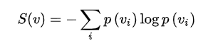

# 百面百搭

> 作者：杨夕、大雨、刘乙己🇻、Stefan、拒绝焦虑李某人、王翔
> 
> 面筋地址：https://github.com/km1994/NLP-Interview-Notes
> 
> 个人笔记：https://github.com/km1994/nlp_paper_study
> 
>  NLP && 推荐学习群【人数满了，加微信 blqkm601 】

- [百面百搭](#百面百搭)
  - [问题一：召回模型中，模型评价指标怎么设计？（推荐）](#问题一召回模型中模型评价指标怎么设计推荐)
  - [问题二：w&d模型的特征，哪些放到wide侧，哪些放到deep侧？ w&d模型在线上，如何做到根据实时数据更新模型（推荐）](#问题二wd模型的特征哪些放到wide侧哪些放到deep侧-wd模型在线上如何做到根据实时数据更新模型推荐)
  - [问题三：怎么衡量两个分布的差异，熵、KL散度和交叉熵损失有什么不同，关系是什么 (机器学习/自然语言处理)](#问题三怎么衡量两个分布的差异熵kl散度和交叉熵损失有什么不同关系是什么-机器学习自然语言处理)
  - [问题四：什么情况下使用动量优化器？（机器学习）](#问题四什么情况下使用动量优化器-机器学习)

## 问题一：召回模型中，模型评价指标怎么设计？（推荐）

> 回答者 1：刘乙己🇻

1. **召回率：**在用户真实购买或者看过的物品中， 模型真正预测出了多少， 这个考察的是模型推荐的一个全面性。

2. **准确率 ：**推荐的所有物品中， 用户真正看的有多少， 这个考察的是模型推荐的一个准确性。 为了提高准确率， 模型需要把非常有把握的才对用户进行推荐， 所以这时候就减少了推荐的数量， 而这往往就损失了全面性， 真正预测出来的会非常少，所以实际应用中应该综合考虑两者的平衡。

3. **Hit Ratio(HR)：**在top-K推荐中，HR是一种常用的衡量召回率的指标，计算公式为：

分母是所有的测试集合，分子表示每个用户top-K列表中属于测试集合的个数的总和。
   
举个简单的例子，三个用户在测试集中的商品个数分别是10，12，8，模型得到的top-10推荐列表中，分别有6个，5个，4个在测试集中，那么此时HR的值是(6+5+4)/(10+12+8) = 0.5。

1. **覆盖率（Coverage）：**描述一个推荐系统对物品长尾的发掘能力。最简单的定义为推荐系统能够推荐出来的物品占总物品集合的比例。

假设系统的用户集合为U，总物品集合为I ，推荐系统给每个用户推荐一个长度为N的物品列表R(u)：

其中I表示所有物品的集合，覆盖率表示最终的推荐列表中包含多大比例的物品，如果所有用户都被推荐给至少一个用户，则覆盖率为100%。可以通过研究物品在推荐列表中出现的次数的分布描述推荐系统挖掘长尾的能力。如果这个分布比较平，那么说明推荐系统的覆盖率比较高，而如果这个分布比较陡峭，说明这个推荐系统的覆盖率比较低。

5. **新颖度：**用推荐列表中物品的平均流行度度量推荐结果的新颖度。 如果推荐出的物品都很热门， 说明推荐的新颖度较低。 由于物品的流行度分布呈长尾分布， 所以为了流行度的平均值更加稳定， 在计算平均流行度时对每个物品的流行度取对数。

> 回答者 2：Stefan

- 线上评估：

1. 可以拿召回的topk个物品，与线上用户实际的点击做交集，或根据线上用户点击的物品在召回集中的平均排名位置
2. 线上也可以直接看一些数据，分析bas case
3. 可以控制精排模型一致，AB分流测试不同的召回模型，直接看最终线上指标变化

- 离线评估：

1. 可以准备一份用户会点击的一些items A，然后用模型预测召回一批items B，看这些items A在items B中的hit数

> 参考资料：[「召回层」如何评估召回效果？](https://mp.weixin.qq.com/s/L4G-Gu5pRc0obbHRZvQy5w)

## 问题二：w&d模型的特征，哪些放到wide侧，哪些放到deep侧？ w&d模型在线上，如何做到根据实时数据更新模型（推荐）

> **【这道题比较发散，最后没 讨论出比较合适的答案，想看大佬博弈，可以点此链接 [群精彩讨论](群精彩讨论/README.md#问题二wd模型的特征哪些放到wide侧哪些放到deep侧-wd模型在线上如何做到根据实时数据更新模型推荐)】**

> 回答者 1：拒绝焦虑李某人

和预测目标强相关的，共现频率高的特征和手工交叉特征可以放到wide侧，其余的放到deep侧，全都放在deep侧应该也行吧。

> 回答者 2：刘乙己??

w&d模型在线上，如何做到根据实时数据更新模型
(推荐)?
模型服务器每次收到（app召回集合+当前用户特征），模型服务器返回每个app的score。
score就是对于wide & deep模型的一次 forward pass。
为了缩短响应时间10ms以内，并行预测，例如可以将分布式多线程的计算不同批次app的得分。

## 问题三：怎么衡量两个分布的差异，熵、KL散度和交叉熵损失有什么不同，关系是什么 (机器学习/自然语言处理)

> 回答者：杨夕

1. 熵 entropy 介绍

- 定义：衡量系统的不确定性（熵越大，信息量越大）
- 公式：

> 注： 
> P(vi)：vi 在系统中概率； 
> S(v)：蕴含的信息量 

2. KL 散度 KL divergence 介绍

- 定义：用来度量两个分布之间的差异。KL 散度全称叫kullback leibler 散度，也叫做相对熵（relative entropy）
- 公式：

> 注： 
> 公式第一部分：A 的熵； 
> 公式第二部分：事件B相对于A的期望值 

3. 交叉熵 cross entropy 介绍

- 定义：在监督学习中，通常是train一个分布在标签的监督下，极大地近似 target distribution
- 公式：

4. 区别

- 概念的角度分析
  - 熵：可以表示一个事件A的自信息量，也就是A包含多少信息，即**衡量系统不确定程度**。
  - KL散度：可以用来表示从事件A的角度来看，事件B有多大不同，即**衡量两个事件/分布之间的不同**。
  - 交叉熵：可以用来表示从事件A的角度来看，如何描述事件B，即**衡量两个事件/分布的近似程度**。

也就是说：KL散度可以被用于计算代价，而在特定情况下最小化KL散度等价于最小化交叉熵。而交叉熵的运算更简单，所以用交叉熵来当做代价。

- 从公式的角度分析：

> 交叉熵 cross entropy = 熵 entropy + KL 散度 KL divergence

5. 参考

- [交叉熵和KL散度有什么区别？](https://zhuanlan.zhihu.com/p/292434104)
- [KL散度与交叉熵区别与联系](https://blog.csdn.net/Dby_freedom/article/details/83374650)

> 回答者：王翔

衡量分布就是减法，至于怎么减，就看本事了。

一个分布减去另一个分布，至于咋减，就看自己了，像KL就是以哪个分布为概率分布，算个信息差，当然你也可以选择其他算法

## 问题四：什么情况下使用动量优化器？（机器学习）

> 回答者1：Rulcy

我只能说出来基于动量的优化器有两个优点：1、优化速度更快。2、更容易跳脱局部最优点。

> 回答者2：Hirah

动量优化器应对poor conditioning Hessian matrix有优势，用符合直觉的方法来解释就是不同维度的优化函数陡峭程度不一样的时候，动量优化器比SGD好。

动量优化器比SGD还有一个优势，SGD mini-batch之间如果方差大的话优化路径会发生震荡，加入动量可以改善这个。

Ian goodfellow的花书讲到动量的时候就讲了这两个motivations。

图例：动量用于解决优化过程中的两个问题：病态条件（poor conditioning）下的黑塞矩阵和随机梯度下降中出现的方差。图例中的黑色箭头代表每一个优化步骤计算出的梯度方向，红色的轨迹则是引入动量后的优化路径。当黑塞矩阵处于病态条件时目标函数呈现出狭长山谷的形状。引入动量能够在优化时修正路径，不至于在峡谷窄侧长期穿梭浪费时间。

> 回答者3:Moonlight

我看到的资料是这样的，比如你有个狭长小路，两边是山峰，容易在山峰来回震荡，而你把这个物体当成个有质量的，把那种来回的动量加到速度上，就能加速在小路上下降的速度，达到提速的效果

### 相关讨论：比较不同的优化器 SGD/AdaGrad/Adam/Momentum

