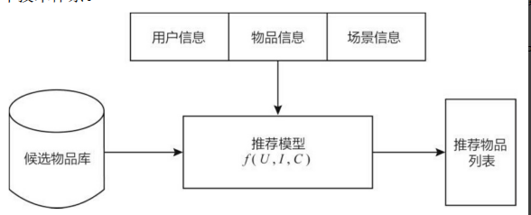

# 推荐系统 百面百搭

> 作者：杨夕、Rulcy、大雨、刘乙己🇻、Stefan、拒绝焦虑李某人、王翔
> 
> NLP 百面百搭 地址：https://github.com/km1994/NLP-Interview-Notes
> 
> **[手机版NLP百面百搭](https://mp.weixin.qq.com/s?__biz=MzAxMTU5Njg4NQ==&mid=100005719&idx=3&sn=5d8e62993e5ecd4582703684c0d12e44&chksm=1bbff26d2cc87b7bf2504a8a4cafc60919d722b6e9acbcee81a626924d80f53a49301df9bd97&scene=18#wechat_redirect)**
> 
> 推荐系统 百面百搭 地址：https://github.com/km1994/RES-Interview-Notes
> 
> **[手机版推荐系统百面百搭](https://mp.weixin.qq.com/s/b_KBT6rUw09cLGRHV_EUtw)**
> 
> NLP论文学习笔记：https://github.com/km1994/nlp_paper_study
> 
> **[手机版NLP论文学习笔记](https://mp.weixin.qq.com/s?__biz=MzAxMTU5Njg4NQ==&mid=100005719&idx=1&sn=14d34d70a7e7cbf9700f804cca5be2d0&chksm=1bbff26d2cc87b7b9d2ed12c8d280cd737e270cd82c8850f7ca2ee44ec8883873ff5e9904e7e&scene=18#wechat_redirect)**
> 

> **关注公众号 【关于NLP那些你不知道的事】 加入 【NLP && 推荐学习群】一起学习！！！**

> 注：github 网页版 看起来不舒服，可以看 **[手机版推荐系统百面百搭](https://mp.weixin.qq.com/s/b_KBT6rUw09cLGRHV_EUtw)**

## 一、推荐系统 导论篇

### 1.1 推荐系统的作用？

- 用户角度：推荐系统解决在“信息过载”的情况下，用户如何高效获得感兴趣信息的问题。
- 公司角度：推荐系统解决产品能够最大限度地吸引用户、留存用户、增加用户黏性、提高用户转化率的问题，从而达到公司商业目标连续增长的目的。

### 1.2 推荐系统的意义？

- 用户体验的优化；
- 满足公司的商业利益；

### 1.3 推荐系统要解决的问题？

推荐系统要解决的“用户痛点”是用户如何在“信息过载”的情况下高效地获得感兴趣的信息。

### 1.4 常用的推荐系统的逻辑框架是怎么样的呢？

> 推荐系统的逻辑框架

对于用户U（user），在特定场景C（context）下，针对海量的“物品”信息，构建一个函数f（U，I，C），预测用户对特定候选物品 I （item）的喜好程度，再根据喜好程度对所有候选物品进行排序，生成推荐列表的问题。 

### 1.5 常用的推荐系统的技术架构是怎么样的呢？

### 1.6 推荐系统算法工程师日常解决问题？

- 数据和信息相关的问题：即“用户信息”“物品信息”“场景信息”分别是什么？如何存储、更新和处理？ 
- 推荐系统算法和模型相关的问题：推荐模型如何训练、如何预测、如何达成更好的推荐效果？ 

### 1.7 推荐系统算法工程师 处理的数据部分有哪些，最后得到什么数据？

- 数据入口：负责“用户”“物品”“场景”的信息收集与处理；
- 数据出口：
  - 生成推荐模型所需的样本数据，用于算法模型的训练和评估；
  - 生成推荐模型服务（model serving）所需的“特征”，用于推荐系统的线上推断；
  - 生成系统监控、商业智能（Business Intelligence，BI）系统所需的统计型数据；

### 1.8 推荐系统算法工程师 处理的模型部分有哪些，最后得到什么数据？

- 组成：
  - “召回层”：利用高效的召回规则、算法或简单的模型，快速从海量的候选集中召回用户可能感兴趣的物品。
  - “排序层”：利用排序模型对初筛的候选集进行精排序。
  - “补充策略与算法层”（再排序层）：在将推荐列表返回用户之前，为兼顾结果的“多样性”“流行度”“新鲜度”等指标，结合一些补充的策略和算法对推荐列表进行一定的调整，最终形成用户可见的推荐列表

### 1.9 模型训练的方式？

- 离线训练：可以利用全量样本和特征，使模型逼近全局最优点；
- 在线更新：可以准实时地“消化”新的数据样本，更快地反映新的数据变化趋势，满足模型实时性的需求。

## 二、推荐系统 机器学习篇

### 2.1 协同过滤篇

### 2.2 矩阵分解算法篇

### 2.3 逻辑回归篇

### 2.4 FM 算法篇

### 2.5 FFM 算法篇

### 2.6 GBDT+LR 篇

### 2.7 LS-PLM 算法篇

## 三、推荐系统 深度学习篇

### 3.1 AutoRec 篇

### 3.2 NeuralCF模型 篇

### 3.3 Deep Crossing模型 篇

### 3.4 PNN 模型 篇

### 3.5 Wide＆Deep模型 篇

### 3.6 FM与深度学习模型的结合 篇

### 3.7 注意力机制在推荐模型中的应用篇

### 3.8 DIEN 篇

## 四、推荐系统 落地篇

## 五、多角度审视推荐系统篇

## 六、推荐系统 评估方法篇

## 七、推荐系统 工程落地篇
