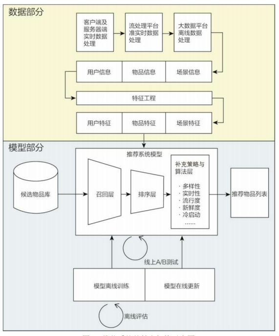
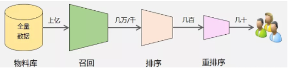
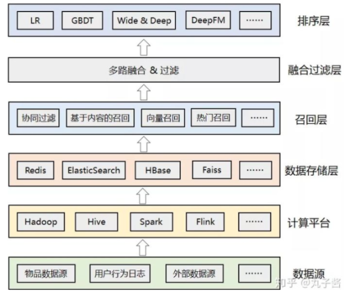

# 【关于 推荐系统 导论篇】 那些你不知道的事

> 作者：杨夕
> 
> 介绍：本项目是作者们根据个人面试和经验总结出的搜索引擎(search engine) 面试准备的学习笔记与资料，该资料目前包含 搜索引擎各领域的 面试题积累。
> 
> NLP 百面百搭 地址：https://github.com/km1994/NLP-Interview-Notes
> 
> **[手机版NLP百面百搭](https://mp.weixin.qq.com/s?__biz=MzAxMTU5Njg4NQ==&mid=100005719&idx=3&sn=5d8e62993e5ecd4582703684c0d12e44&chksm=1bbff26d2cc87b7bf2504a8a4cafc60919d722b6e9acbcee81a626924d80f53a49301df9bd97&scene=18#wechat_redirect)**
> 
> 推荐系统 百面百搭 地址：https://github.com/km1994/RES-Interview-Notes
> 
> **[手机版推荐系统百面百搭](https://mp.weixin.qq.com/s/b_KBT6rUw09cLGRHV_EUtw)**
> 
> 搜索引擎 百面百搭 地址：https://github.com/km1994/search-engine-Interview-Notes 【编写ing】
> 
> NLP论文学习笔记：https://github.com/km1994/nlp_paper_study
> 
> 推荐系统论文学习笔记：https://github.com/km1994/RS_paper_study
> 
> GCN 论文学习笔记：https://github.com/km1994/GCN_study

> 关注公众号 **【关于NLP那些你不知道的事】** 加入 【NLP && 推荐学习群】一起学习！！！

> 注：github 网页版 看起来不舒服，可以看 **[手机版推荐系统百面百搭](https://mp.weixin.qq.com/s/b_KBT6rUw09cLGRHV_EUtw)**

- [【关于 推荐系统 导论篇】 那些你不知道的事](#关于-推荐系统-导论篇-那些你不知道的事)
  - [1.1 什么是推荐系统？](#11-什么是推荐系统)
  - [1.2 推荐系统的作用？](#12-推荐系统的作用)
  - [1.3 推荐系统的意义？](#13-推荐系统的意义)
  - [1.4 推荐系统要解决的问题？](#14-推荐系统要解决的问题)
  - [1.5 常用的推荐系统的逻辑框架是怎么样的呢？](#15-常用的推荐系统的逻辑框架是怎么样的呢)
  - [1.6 常用的推荐系统的技术架构是怎么样的呢？](#16-常用的推荐系统的技术架构是怎么样的呢)
  - [1.7 推荐系统算法工程师日常解决问题？](#17-推荐系统算法工程师日常解决问题)
  - [1.8 推荐系统算法工程师 处理的数据部分有哪些，最后得到什么数据？](#18-推荐系统算法工程师-处理的数据部分有哪些最后得到什么数据)
  - [1.9 推荐系统算法工程师 处理的模型部分有哪些，最后得到什么数据？](#19-推荐系统算法工程师-处理的模型部分有哪些最后得到什么数据)
  - [1.10 模型训练的方式？](#110-模型训练的方式)
  - [1.11 推荐系统 的 流程是什么？](#111-推荐系统-的-流程是什么)
  - [1.12 推荐系统 的 流程是什么？](#112-推荐系统-的-流程是什么)
  - [1.13 推荐系统 与 搜索、广告 的 异同？](#113-推荐系统-与-搜索广告-的-异同)
  - [1.14 推荐系统 整体架构？](#114-推荐系统-整体架构)
  - [参考](#参考)

## 1.1 什么是推荐系统？

“啤酒与尿布” 的故事相信很多人都听过，年轻爸爸去超市购买尿布时，经常会买点啤酒犒劳自己。因此，沃尔玛将这两种商品进行了捆绑销售，最终获得了更好的销量。

这个故事背后的理论依据就是 “推荐算法”，因为尿布和啤酒经常出现在同一个购物车中，那么向购买尿布的年轻爸爸推荐啤酒确实有一定道理。

## 1.2 推荐系统的作用？

- 用户角度：推荐系统解决在“信息过载”的情况下，用户如何高效获得感兴趣信息的问题。
- 公司角度：推荐系统解决产品能够最大限度地吸引用户、留存用户、增加用户黏性、提高用户转化率的问题，从而达到公司商业目标连续增长的目的。

## 1.3 推荐系统的意义？

- 用户体验的优化；
- 满足公司的商业利益；

## 1.4 推荐系统要解决的问题？

推荐系统要解决的“用户痛点”是用户如何在“信息过载”的情况下高效地获得感兴趣的信息。

## 1.5 常用的推荐系统的逻辑框架是怎么样的呢？

> 推荐系统的逻辑框架

对于用户U（user），在特定场景C（context）下，针对海量的“物品”信息，构建一个函数f（U，I，C），预测用户对特定候选物品 I （item）的喜好程度，再根据喜好程度对所有候选物品进行排序，生成推荐列表的问题。 

## 1.6 常用的推荐系统的技术架构是怎么样的呢？

## 1.7 推荐系统算法工程师日常解决问题？

- 数据和信息相关的问题：即“用户信息”“物品信息”“场景信息”分别是什么？如何存储、更新和处理？ 
- 推荐系统算法和模型相关的问题：推荐模型如何训练、如何预测、如何达成更好的推荐效果？ 

## 1.8 推荐系统算法工程师 处理的数据部分有哪些，最后得到什么数据？

- 数据入口：负责“用户”“物品”“场景”的信息收集与处理；
- 数据出口：
  - 生成推荐模型所需的样本数据，用于算法模型的训练和评估；
  - 生成推荐模型服务（model serving）所需的“特征”，用于推荐系统的线上推断；
  - 生成系统监控、商业智能（Business Intelligence，BI）系统所需的统计型数据；

## 1.9 推荐系统算法工程师 处理的模型部分有哪些，最后得到什么数据？

- 组成：
  - “召回层”：利用高效的召回规则、算法或简单的模型，快速从海量的候选集中召回用户可能感兴趣的物品。
  - “排序层”：利用排序模型对初筛的候选集进行精排序。
  - “补充策略与算法层”（再排序层）：在将推荐列表返回用户之前，为兼顾结果的“多样性”“流行度”“新鲜度”等指标，结合一些补充的策略和算法对推荐列表进行一定的调整，最终形成用户可见的推荐列表

## 1.10 模型训练的方式？

- 离线训练：可以利用全量样本和特征，使模型逼近全局最优点；
- 在线更新：可以准实时地“消化”新的数据样本，更快地反映新的数据变化趋势，满足模型实时性的需求。

## 1.11 推荐系统 的 流程是什么？

- 本质：信息过滤系统；
- 流程：召回->排序->重排序
- 目标：每个环节逐层过滤，最终从海量的物料库中筛选出几十个用户可能感兴趣的物品推荐给用户

## 1.12 推荐系统 的 流程是什么？

- 场景：
  - 资讯类：今日头条、腾讯新闻等
  - 电商类：淘宝、京东、拼多多、亚马逊等
  - 娱乐类：抖音、快手、爱奇艺等
  - 生活服务类：美团、大众点评、携程等
  - 社交类：微信、陌陌、脉脉等
- 按类别分类：
  - 基于用户维度的推荐：根据用户的历史行为和兴趣进行推荐，比如淘宝首页的猜你喜欢、抖音的首页推荐等；
  - 基于物品维度的推荐：根据用户当前浏览的标的物进行推荐，比如打开京东APP的商品详情页，会推荐和主商品相关的商品给你；

## 1.13 推荐系统 与 搜索、广告 的 异同？

- 搜索：有明确的搜索意图，搜索出来的结果和用户的搜索词相关；
- 推荐：不具有目的性，依赖用户的历史行为和画像数据进行个性化推荐；
- 广告：借助搜索和推荐技术实现广告的精准投放，可以将广告理解成搜索推荐的一种应用场景，技术方案更复杂，涉及到智能预算控制、广告竞价等；

## 1.14 推荐系统 整体架构？

- 数据源：推荐算法所依赖的各种数据源，包括物品数据、用户数据、行为日志、其他可利用的业务数据、甚至公司外部的数据。
- 计算平台：负责对底层的各种异构数据进行清洗、加工，离线计算和实时计算。
- 数据存储层：存储计算平台处理后的数据，根据需要可落地到不同的存储系统中，比如Redis中可以存储用户特征和用户画像数据，ES中可以用来索引物品数据，Faiss中可以存储用户或者物品的embedding向量等。
- 召回层：包括各种推荐策略或者算法，比如经典的协同过滤，基于内容的召回，基于向量的召回，用于托底的热门推荐等。为了应对线上高并发的流量，召回结果通常会预计算好，建立好倒排索引后存入缓存中。
- 融合过滤层：触发多路召回，由于召回层的每个召回源都会返回一个候选集，因此这一层需要进行融合和过滤。
- 排序层：利用机器学习或者深度学习模型，以及更丰富的特征进行重排序，筛选出更小、更精准的推荐集合返回给上层业务。

## 参考

- [深度学习与推荐系统 王喆](https://item.jd.com/12630209.html)