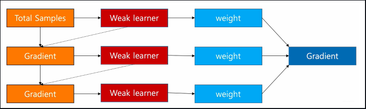
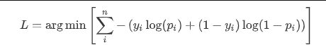
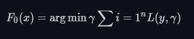
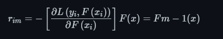
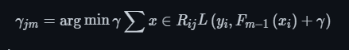
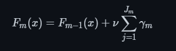
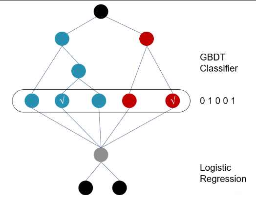

# 【关于 GBDT+LR 篇】 那些你不知道的事

> 作者：杨夕
> 
> NLP 百面百搭 地址：https://github.com/km1994/NLP-Interview-Notes
> 
> **[手机版NLP百面百搭](https://mp.weixin.qq.com/s?__biz=MzAxMTU5Njg4NQ==&mid=100005719&idx=3&sn=5d8e62993e5ecd4582703684c0d12e44&chksm=1bbff26d2cc87b7bf2504a8a4cafc60919d722b6e9acbcee81a626924d80f53a49301df9bd97&scene=18#wechat_redirect)**
> 
> 推荐系统 百面百搭 地址：https://github.com/km1994/RES-Interview-Notes
> 
> **[手机版推荐系统百面百搭](https://mp.weixin.qq.com/s/b_KBT6rUw09cLGRHV_EUtw)**
> 
> NLP论文学习笔记：https://github.com/km1994/nlp_paper_study
> 
> **[手机版NLP论文学习笔记](https://mp.weixin.qq.com/s?__biz=MzAxMTU5Njg4NQ==&mid=100005719&idx=1&sn=14d34d70a7e7cbf9700f804cca5be2d0&chksm=1bbff26d2cc87b7b9d2ed12c8d280cd737e270cd82c8850f7ca2ee44ec8883873ff5e9904e7e&scene=18#wechat_redirect)**
> 

> **关注公众号 【关于NLP那些你不知道的事】 加入 【NLP && 推荐学习群】一起学习！！！**

> 注：github 网页版 看起来不舒服，可以看 **[手机版推荐系统百面百搭](https://mp.weixin.qq.com/s/b_KBT6rUw09cLGRHV_EUtw)**

- [【关于 GBDT+LR 篇】 那些你不知道的事](#关于-gbdtlr-篇-那些你不知道的事)
  - [一、动机篇](#一动机篇)
    - [1.1 为什么 需要 GBDT+LR？](#11-为什么-需要-gbdtlr)
  - [二、GBDT 介绍篇](#二gbdt-介绍篇)
    - [2.1 GBDT 的基础结构是什么样的？](#21-gbdt-的基础结构是什么样的)
    - [2.2 GBDT 的学习方式？](#22-gbdt-的学习方式)
    - [2.3 GBDT 的思路？](#23-gbdt-的思路)
    - [2.4 GBDT 的特点是怎么样？](#24-gbdt-的特点是怎么样)
    - [2.5 GBDT 所用分类器是什么？](#25-gbdt-所用分类器是什么)
    - [2.6 GBDT 解决二分类和回归问题的方式？](#26-gbdt-解决二分类和回归问题的方式)
    - [2.7 GBDT 损失函数 是什么？](#27-gbdt-损失函数-是什么)
    - [2.8 构建分类GBDT的步骤 是什么？](#28-构建分类gbdt的步骤-是什么)
    - [2.9 GBDT 优缺点篇？](#29-gbdt-优缺点篇)
  - [三、GBDT+LR 模型介绍篇](#三gbdtlr-模型介绍篇)
    - [3.1 GBDT+LR 模型 思路是什么样？](#31-gbdtlr-模型-思路是什么样)
    - [3.2 GBDT+LR 模型 步骤是什么样？](#32-gbdtlr-模型-步骤是什么样)
    - [3.3 GBDT+LR 模型 关键点是什么样？](#33-gbdtlr-模型-关键点是什么样)
    - [3.4 GBDT+LR 模型 本质是什么样？](#34-gbdtlr-模型-本质是什么样)
  - [四、GBDT+LR 优缺点篇](#四gbdtlr-优缺点篇)
    - [4.1 GBDT+LR 的优点是什么？](#41-gbdtlr-的优点是什么)
    - [4.2 GBDT+LR 的缺点是什么？](#42-gbdtlr-的缺点是什么)
  - [参考](#参考)

## 一、动机篇

### 1.1 为什么 需要 GBDT+LR？

1. 协同过滤和矩阵分解存在问题

- 仅利用了用户与物品相互行为信息进行推荐， 忽视了用户自身特征， 物品自身特征以及上下文信息等，导致生成的结果往往会比较片面。

2. FFM 存在问题

- FFM特征交叉能力有限：虽然 FFM 模型采用引入特征域的方式增强了模型的特征交叉能力，只能做二阶的特征交叉，如果继续提高特征交叉的维度，会不可避免地产生组合爆炸和计算复杂度过高的问题。

3. LR 存在问题

- 表达能力不强， 无法进行特征交叉， 特征筛选等一系列“高级“操作（这些工作都得人工来干， 这样就需要一定的经验， 否则会走一些弯路）， 因此可能造成信息的损失
- 准确率并不是很高。因为这毕竟是一个线性模型加了个sigmoid， 形式非常的简单(非常类似线性模型)，很难去拟合数据的真实分布
- 处理非线性数据较麻烦。逻辑回归在不引入其他方法的情况下，只能处理线性可分的数据， 如果想处理非线性， 首先对连续特征的处理需要先进行离散化（离散化的目的是为了引入非线性），如上文所说，人工分桶的方式会引入多种问题。
- LR 需要进行人工特征组合，这就需要开发者有非常丰富的领域经验，才能不走弯路。这样的模型迁移起来比较困难，换一个领域又需要重新进行大量的特征工程。

## 二、GBDT 介绍篇

### 2.1 GBDT 的基础结构是什么样的？

- 基本结构：决策树组成的树林

### 2.2 GBDT 的学习方式？

- 学习方式：是梯度提升

### 2.3 GBDT 的思路？

- 思路：通过采用加法模型(即基函数的线性组合），以及不断减小训练过程产生的误差来达到将数据分类或者回归的算法， 其训练过程如下：

> 通过多轮迭代， 每轮迭代会产生一个弱分类器， 每个分类器在上一轮分类器的残差基础上进行训练。 GBDT 对弱分类器的要求一般是足够简单， 并且低方差高偏差。 因为训练的过程是通过降低偏差来不断提高最终分类器的精度。 由于上述高偏差和简单的要求，每个分类回归树的深度不会很深。最终的总分类器是将每轮训练得到的弱分类器加权求和得到的（也就是加法模型）。

### 2.4 GBDT 的特点是怎么样？

每轮的训练是在上一轮的训练的残差基础之上进行训练的**， 而这里的残差指的就是当前模型的负梯度值， 这个就要求每轮迭代的时候，弱分类器的输出的结果相减是有意义的；

### 2.5 GBDT 所用分类器是什么？

- 分类器：CART 回归树

### 2.6 GBDT 解决二分类和回归问题的方式？

通过不断构建决策树的方式，使预测结果一步步的接近目标值， 但是二分类问题和回归问题的损失函数是不同的。

### 2.7 GBDT 损失函数 是什么？

- 回归问题：平方损失
- 二分类问题：

> 其中， $y_i$是第$i$个样本的观测值， 取值要么是0要么是1， 而$p_i$是第$i$个样本的预测值， 取值是0-1之间的概率，由于我们知道GBDT拟合的残差是当前模型的负梯度，

### 2.8 构建分类GBDT的步骤 是什么？

1. 初始化GBDT

和回归问题一样， 分类 GBDT 的初始状态也只有一个叶子节点，该节点为所有样本的初始预测值，如下：

> 上式里面， $F$代表GBDT模型， $F_0$是模型的初识状态， 该式子的意思是找到一个$\gamma$，使所有样本的 Loss 最小，在这里及下文中，$\gamma$都表示节点的输出，即叶子节点， 且它是一个 $log(\eta_i)$ 形式的值(回归值)，在初始状态，$\gamma =F_0$。

2. 循环生成决策树
3. 第一就是计算负梯度值得到残差;
   

> 使用$m-1$棵树的模型， 计算每个样本的残差$r_{im}$, 就是上面的$y_i-pi$;

4. 第二步是用回归树拟合残差$r_{im}$

这里的$i$表示样本哈，回归树的建立过程可以参考下面的链接文章，简单的说就是遍历每个特征， 每个特征下遍历每个取值， 计算分裂后两组数据的平方损失， 找到最小的那个划分节点。

5. 第三步对于每个叶子节点$j$, 计算最佳残差拟合值
   

在刚构建的树$m$中， 找到每个节点$j$的输出$\gamma_{jm}$, 能使得该节点的loss最小

6. 第四步是 更新模型$F_m(x)$

这样， 通过多次循环迭代， 就可以得到一个比较强的学习器$F_m(x)$

### 2.9 GBDT 优缺点篇？

- 优点：把树的生成过程理解成自动进行多维度的特征组合的过程，从根结点到叶子节点上的整个路径(多个特征值判断)，才能最终决定一棵树的预测值， 另外，对于连续型特征的处理，GBDT 可以拆分出一个临界阈值，比如大于 0.027 走左子树，小于等于 0.027（或者 default 值）走右子树，这样很好的规避了人工离散化的问题。这样就非常轻松的解决了逻辑回归那里自动发现特征并进行有效组合的问题；
- 缺点： 对于海量的 id 类特征，GBDT 由于树的深度和棵树限制（防止过拟合），不能有效的存储；另外海量特征在也会存在性能瓶颈，当 GBDT 的 one hot 特征大于 10 万维时，就必须做分布式的训练才能保证不爆内存。所以 GBDT 通常配合少量的反馈 CTR 特征来表达，这样虽然具有一定的范化能力，但是同时会有信息损失，对于头部资源不能有效的表达。

## 三、GBDT+LR 模型介绍篇

### 3.1 GBDT+LR 模型 思路是什么样？

1. 利用GBDT自动进行特征筛选和组合，进而生成新的离散特征向量；
2. 再把该特征向量当做LR模型的输入， 来产生最后的预测结果；

### 3.2 GBDT+LR 模型 步骤是什么样？

- 训练时，GBDT 建树的过程相当于自动进行的特征组合和离散化，然后从根结点到叶子节点的这条路径就可以看成是不同特征进行的特征组合，用叶子节点可以唯一的表示这条路径，并作为一个离散特征传入 LR 进行二次训练。

比如上图中， 有两棵树，x为一条输入样本，遍历两棵树后，x样本分别落到两颗树的叶子节点上，每个叶子节点对应LR一维特征，那么通过遍历树，就得到了该样本对应的所有LR特征。构造的新特征向量是取值0/1的。 比如左树有三个叶子节点，右树有两个叶子节点，最终的特征即为五维的向量。对于输入x，假设他落在左树第二个节点，编码[0,1,0]，落在右树第二个节点则编码[0,1]，所以整体的编码为[0,1,0,0,1]，这类编码作为特征，输入到线性分类模型（LR or FM）中进行分类。

- 预测时，会先走 GBDT 的每棵树，得到某个叶子节点对应的一个离散特征(即一组特征组合)，然后把该特征以 one-hot 形式传入 LR 进行线性加权预测。

### 3.3 GBDT+LR 模型 关键点是什么样？

1. 通过GBDT进行特征组合之后得到的离散向量是和训练数据的原特征一块作为逻辑回归的输入， 而不仅仅全是这种离散特征
2. 建树的时候用ensemble建树的原因就是一棵树的表达能力很弱，不足以表达多个有区分性的特征组合，多棵树的表达能力更强一些。GBDT每棵树都在学习前面棵树尚存的不足，迭代多少次就会生成多少棵树。
3. RF也是多棵树，但从效果上有实践证明不如GBDT。且GBDT前面的树，特征分裂主要体现对多数样本有区分度的特征；后面的树，主要体现的是经过前N颗树，残差仍然较大的少数样本。优先选用在整体上有区分度的特征，再选用针对少数样本有区分度的特征，思路更加合理，这应该也是用GBDT的原因。
4. 在CRT预估中， GBDT一般会建立两类树(非ID特征建一类， ID类特征建一类)， AD，ID类特征在CTR预估中是非常重要的特征，直接将AD，ID作为feature进行建树不可行，故考虑为每个AD，ID建GBDT树。
5. 非ID类树：不以细粒度的ID建树，此类树作为base，即便曝光少的广告、广告主，仍可以通过此类树得到有区分性的特征、特征组合
6. ID类树：以细粒度 的ID建一类树，用于发现曝光充分的ID对应有区分性的特征、特征组合

### 3.4 GBDT+LR 模型 本质是什么样？

通过GBDT来对样本进行分群，然后再通过LR来从全局角度考虑各样本群的权重。

## 四、GBDT+LR 优缺点篇

### 4.1 GBDT+LR 的优点是什么？

- GBDT+LR 的特征组合能力强

### 4.2 GBDT+LR 的缺点是什么？

- GBDT 容易产生过拟合
- GBDT 的特征转换方式实际上丢失了大量特征的数值信息

## 参考

- [深度学习与推荐系统 王喆](https://item.jd.com/12630209.html)
- [team-learning-rs](https://github.com/datawhalechina/team-learning-rss)