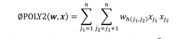

# 【关于POLY2篇】那些你不知道的事

> 作者：杨夕
> 
> NLP 百面百搭 地址：https://github.com/km1994/NLP-Interview-Notes
> 
> **[手机版NLP百面百搭](https://mp.weixin.qq.com/s?__biz=MzAxMTU5Njg4NQ==&mid=100005719&idx=3&sn=5d8e62993e5ecd4582703684c0d12e44&chksm=1bbff26d2cc87b7bf2504a8a4cafc60919d722b6e9acbcee81a626924d80f53a49301df9bd97&scene=18#wechat_redirect)**
> 
> 推荐系统 百面百搭 地址：https://github.com/km1994/RES-Interview-Notes
> 
> **[手机版推荐系统百面百搭](https://mp.weixin.qq.com/s/b_KBT6rUw09cLGRHV_EUtw)**
> 
> NLP论文学习笔记：https://github.com/km1994/nlp_paper_study
> 
> **[手机版NLP论文学习笔记](https://mp.weixin.qq.com/s?__biz=MzAxMTU5Njg4NQ==&mid=100005719&idx=1&sn=14d34d70a7e7cbf9700f804cca5be2d0&chksm=1bbff26d2cc87b7b9d2ed12c8d280cd737e270cd82c8850f7ca2ee44ec8883873ff5e9904e7e&scene=18#wechat_redirect)**
> 

> **关注公众号 【关于NLP那些你不知道的事】 加入 【NLP && 推荐学习群】一起学习！！！**

> 注：github 网页版 看起来不舒服，可以看 **[手机版推荐系统百面百搭](https://mp.weixin.qq.com/s/b_KBT6rUw09cLGRHV_EUtw)**

- [【关于POLY2篇】那些你不知道的事](#关于poly2篇那些你不知道的事)
  - [一、为什么要使用 POLY2？](#一为什么要使用-poly2)
  - [二、POLY2 的思路是什么？](#二poly2-的思路是什么)
  - [三、POLY2 存在什么问题？](#三poly2-存在什么问题)
  - [参考](#参考)

## 一、为什么要使用 POLY2？

1. LR 表达能力不强问题。由于LR表达能力不强，导致模型学习的时候，有效信息容易丢失。
2. 单一特征存在信息损失问题。在仅利用单一特征而非交叉特征进行判断的情况下，有时不仅是信息损失的问题，甚至会得出错误的结论。
3. 手动构建组合特征，再筛选的方法比较低效问题。

## 二、POLY2 的思路是什么？

PLOY2模型 采用 “暴力”组合 的方式对特征进行交叉。

该模型对所有特征进行了两两交叉（特征 $x_j1$ 和 $x_j2$ ），并对所有的特征组合赋予权重 $w_{h(j1,j2)}$ 。POLY2 通过暴力组合特征的方式，在一定程度上解决了特征组合的问题。

## 三、POLY2 存在什么问题？

1. 特征稀疏问题。在处理互联网数据时，经常采用 one-hot 编码的方法处理类别型数据，致使特征向量极度稀疏，POLY2进行无选择的特征交叉——原本就非常稀疏的特征向量更加稀疏，导致大部分交叉特征的权重缺乏有效的数据进行训练，无法收敛。
2. 复杂度增加问题。权重参数的数量由n直接上升到n^2，极大地增加了训练复杂度。

## 参考

- [深度学习与推荐系统 王喆](https://item.jd.com/12630209.html)