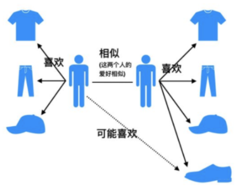
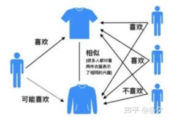

# 【关于 协同过滤篇】 那些你不知道的事

> 作者：杨夕
> 
> NLP 百面百搭 地址：https://github.com/km1994/NLP-Interview-Notes
> 
> **[手机版NLP百面百搭](https://mp.weixin.qq.com/s?__biz=MzAxMTU5Njg4NQ==&mid=100005719&idx=3&sn=5d8e62993e5ecd4582703684c0d12e44&chksm=1bbff26d2cc87b7bf2504a8a4cafc60919d722b6e9acbcee81a626924d80f53a49301df9bd97&scene=18#wechat_redirect)**
> 
> 推荐系统 百面百搭 地址：https://github.com/km1994/RES-Interview-Notes
> 
> **[手机版推荐系统百面百搭](https://mp.weixin.qq.com/s/b_KBT6rUw09cLGRHV_EUtw)**
> 
> NLP论文学习笔记：https://github.com/km1994/nlp_paper_study
> 
> **[手机版NLP论文学习笔记](https://mp.weixin.qq.com/s?__biz=MzAxMTU5Njg4NQ==&mid=100005719&idx=1&sn=14d34d70a7e7cbf9700f804cca5be2d0&chksm=1bbff26d2cc87b7b9d2ed12c8d280cd737e270cd82c8850f7ca2ee44ec8883873ff5e9904e7e&scene=18#wechat_redirect)**
> 

> **关注公众号 【关于NLP那些你不知道的事】 加入 【NLP && 推荐学习群】一起学习！！！**

> 注：github 网页版 看起来不舒服，可以看 **[手机版推荐系统百面百搭](https://mp.weixin.qq.com/s/b_KBT6rUw09cLGRHV_EUtw)**

- [【关于 协同过滤篇】 那些你不知道的事](#关于-协同过滤篇-那些你不知道的事)
  - [一、基础篇](#一基础篇)
    - [1.1 什么是协同过滤？](#11-什么是协同过滤)
    - [1.2 协同过滤的推荐流程是怎么样？](#12-协同过滤的推荐流程是怎么样)
  - [二、基于用户的协同过滤 （User-CF-Based）篇](#二基于用户的协同过滤-user-cf-based篇)
    - [2.1 基于用户的协同过滤 （User-CF-Based） 是什么？](#21-基于用户的协同过滤-user-cf-based-是什么)
    - [2.2 基于用户的协同过滤 （User-CF-Based） 的思想是什么？](#22-基于用户的协同过滤-user-cf-based-的思想是什么)
    - [2.3 基于用户的协同过滤 （User-CF-Based） 的特点是什么？](#23-基于用户的协同过滤-user-cf-based-的特点是什么)
  - [三、基于物品的协同过滤 （Item-CF-Based）篇](#三基于物品的协同过滤-item-cf-based篇)
    - [3.1 基于物品的协同过滤 （Item-CF-Based） 是什么？](#31-基于物品的协同过滤-item-cf-based-是什么)
    - [3.2 基于物品的协同过滤 （Item-CF-Based） 的思想是什么？](#32-基于物品的协同过滤-item-cf-based-的思想是什么)
    - [3.3 基于物品的协同过滤 （Item-CF-Based） 的特点是什么？](#33-基于物品的协同过滤-item-cf-based-的特点是什么)
    - [3.4 基于物品的协同过滤 （Item-CF-Based） 的具体步骤是什么？](#34-基于物品的协同过滤-item-cf-based-的具体步骤是什么)
  - [四、User-CF-Based 与 Item-CF-Based 对比篇](#四user-cf-based-与-item-cf-based-对比篇)
    - [4.1 User-CF-Based 与 Item-CF-Based 的应用场景的区别](#41-user-cf-based-与-item-cf-based-的应用场景的区别)
    - [4.2 User-CF-Based 与 Item-CF-Based 的存在问题的区别](#42-user-cf-based-与-item-cf-based-的存在问题的区别)
  - [五、User-CF-Based 与 Item-CF-Based 问题篇](#五user-cf-based-与-item-cf-based-问题篇)
  - [参考](#参考)

## 一、基础篇

### 1.1 什么是协同过滤？

协同大家的反馈、评价和意见一起对海量的信息进行过滤，从中筛选出目标用户可能感兴趣的信息的推荐过程。

### 1.2 协同过滤的推荐流程是怎么样？

## 二、基于用户的协同过滤 （User-CF-Based）篇

### 2.1 基于用户的协同过滤 （User-CF-Based） 是什么？

先 “找到相似用户”，再“找到他们喜欢的物品”。

> 注：左边用户和右边用户都喜欢相同的商品，那么这个时候 左边用户有可能也喜欢 右边用户所喜欢的鞋子

### 2.2 基于用户的协同过滤 （User-CF-Based） 的思想是什么？

1. 计算 C 用户的相似用户；
2. 找到相似用户喜欢，但是 C用户 没有评分过的物品推荐给 用户C;

### 2.3 基于用户的协同过滤 （User-CF-Based） 的特点是什么？

注重 大众化

## 三、基于物品的协同过滤 （Item-CF-Based）篇

### 3.1 基于物品的协同过滤 （Item-CF-Based） 是什么？

先 “找到用户喜欢的物品”，再“找到喜欢的物品的相似物品”。

> 注：左边用户和右边用户都喜欢上面的商品，那么这个时候 左边用户有可能也喜欢 右边用户所喜欢的下面的商品

### 3.2 基于物品的协同过滤 （Item-CF-Based） 的思想是什么？

1. 计算 物品间相似度；
2. 根据用户历史行为鱼物品相似度，为用户生成推荐列表；

### 3.3 基于物品的协同过滤 （Item-CF-Based） 的特点是什么？

注重 个性化

### 3.4 基于物品的协同过滤 （Item-CF-Based） 的具体步骤是什么？

1. 基于历史数据，构建以用户（假设用户总数为m）为行坐标，物品（物品总数为n）为列坐标的m×n维的共现矩阵。
2. 计算共现矩阵两两列向量间的相似性（相似度的计算方式与用户相似度的计算方式相同），构建n×n维的物品相似度矩阵。
3. 获得用户历史行为数据中的正反馈物品列表。
4. 利用物品相似度矩阵，针对目标用户历史行为中的正反馈物品，找出相似的Top k个物品，组成相似物品集合。
5. 对相似物品集合中的物品，利用相似度分值进行排序，生成最终的推荐列表。

## 四、User-CF-Based 与 Item-CF-Based 对比篇

### 4.1 User-CF-Based 与 Item-CF-Based 的应用场景的区别

- User-CF-Based
  - 具备更强的社交特性：用户能够快速得知与自己兴趣相似的人最近喜欢的是什么
  - 适用于：物品》用户的场景  （新闻推荐场景）
    - 因为新闻本身的兴趣点往往是分散的，相比用户对不同新闻的兴趣偏好，新闻的及时性、热点性往往是其更重要的属性，而UserCF正适用于发现热点，以及跟踪热点的趋势
- Item-CF-Based
  - 适用于：用户》物品 的场景  适用于兴趣变化较为稳定的应用

### 4.2 User-CF-Based 与 Item-CF-Based 的存在问题的区别

- User-CF-Based
  - 在互联网应用的场景下，用户数往往远大于物品数，而 UserCF 需要维护用户相似度矩阵以便快速找出 TopN 相似用户。
  - 用户的历史数据向量往往非常稀疏，对于只有几次购买或者点击行为的用户来说，找到相似用户的准确度是非常低的，这导致 UserCF 不适用于那些正反馈获取较困难的应用场景（如酒店预定、大件商品购买等低频应用）。

## 五、User-CF-Based 与 Item-CF-Based 问题篇

1. 数据稀疏性。尾部的物品由于特征向量稀疏，很少与其他物品产生相似性，导致很少被推荐。
2. 缺乏泛化性。
3. 算法扩展性。基于用户的协同过滤需要维护用户相似度矩阵以便快速的找出Topn相似用户， 该矩阵的存储开销非常大，存储空间随着用户数量的增加而增加，不适合用户数据量大的情况使用；
4. 没有利用到物品本身或者是用户自身的属性， 仅仅利用了用户与物品的交互信息就可以实现推荐，比较简单高效， 但这也是它的一个短板所在， 由于无法有效的引入用户年龄， 性别，商品描述，商品分类，当前时间，地点等一系列用户特征、物品特征和上下文特征， 这就造成了有效信息的遗漏，不能充分利用其它特征数据。
5. 马太效应。热门的物品具有很强的头部效应，容易跟大量物品产生相似性

## 参考

- [深度学习与推荐系统 王喆](https://item.jd.com/12630209.html)

