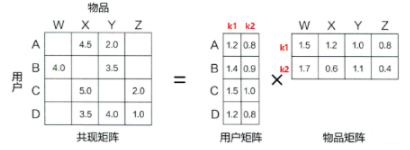
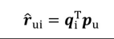

# 【关于 矩阵分解篇】 那些你不知道的事

> 作者：杨夕
> 
> NLP 百面百搭 地址：https://github.com/km1994/NLP-Interview-Notes
> 
> **[手机版NLP百面百搭](https://mp.weixin.qq.com/s?__biz=MzAxMTU5Njg4NQ==&mid=100005719&idx=3&sn=5d8e62993e5ecd4582703684c0d12e44&chksm=1bbff26d2cc87b7bf2504a8a4cafc60919d722b6e9acbcee81a626924d80f53a49301df9bd97&scene=18#wechat_redirect)**
> 
> 推荐系统 百面百搭 地址：https://github.com/km1994/RES-Interview-Notes
> 
> **[手机版推荐系统百面百搭](https://mp.weixin.qq.com/s/b_KBT6rUw09cLGRHV_EUtw)**
> 
> NLP论文学习笔记：https://github.com/km1994/nlp_paper_study
> 
> **[手机版NLP论文学习笔记](https://mp.weixin.qq.com/s?__biz=MzAxMTU5Njg4NQ==&mid=100005719&idx=1&sn=14d34d70a7e7cbf9700f804cca5be2d0&chksm=1bbff26d2cc87b7b9d2ed12c8d280cd737e270cd82c8850f7ca2ee44ec8883873ff5e9904e7e&scene=18#wechat_redirect)**
> 

> **关注公众号 【关于NLP那些你不知道的事】 加入 【NLP && 推荐学习群】一起学习！！！**

> 注：github 网页版 看起来不舒服，可以看 **[手机版推荐系统百面百搭](https://mp.weixin.qq.com/s/b_KBT6rUw09cLGRHV_EUtw)**

- [【关于 矩阵分解篇】 那些你不知道的事](#关于-矩阵分解篇-那些你不知道的事)
  - [一、动机篇](#一动机篇)
    - [1.1 为什么 需要 矩阵分解？](#11-为什么-需要-矩阵分解)
  - [二、隐语义模型 介绍篇](#二隐语义模型-介绍篇)
    - [2.1 什么是 隐语义模型？](#21-什么是-隐语义模型)
    - [2.2 隐语义模型 存在什么问题？](#22-隐语义模型-存在什么问题)
  - [三、矩阵分解 介绍篇](#三矩阵分解-介绍篇)
    - [3.1 如何 获取 ⽤户矩阵Q 和 音乐矩阵P？](#31-如何-获取-户矩阵q-和-音乐矩阵p)
    - [3.2 矩阵分解 思路 是什么？](#32-矩阵分解-思路-是什么)
    - [3.3 矩阵分解 原理 是什么？](#33-矩阵分解-原理-是什么)
    - [3.4 如何 利用 矩阵分解 计算 用户 u 对 物品 v 的 评分？](#34-如何-利用-矩阵分解-计算-用户-u-对-物品-v-的-评分)
  - [四、矩阵分解 优缺点篇](#四矩阵分解-优缺点篇)
    - [4.1 矩阵分解 存在什么问题？](#41-矩阵分解-存在什么问题)
  - [参考](#参考)

## 一、动机篇

### 1.1 为什么 需要 矩阵分解？

- 协同过滤算法 所存在的问题：

1. 数据稀疏性。尾部的物品由于特征向量稀疏，很少与其他物品产生相似性，导致很少被推荐。
2. 缺乏泛化性。
3. 算法扩展性。基于用户的协同过滤需要维护用户相似度矩阵以便快速的找出Topn相似用户， 该矩阵的存储开销非常大，存储空间随着用户数量的增加而增加，不适合用户数据量大的情况使用；
4. 没有利用到物品本身或者是用户自身的属性， 仅仅利用了用户与物品的交互信息就可以实现推荐，比较简单高效， 但这也是它的一个短板所在， 由于无法有效的引入用户年龄， 性别，商品描述，商品分类，当前时间，地点等一系列用户特征、物品特征和上下文特征， 这就造成了有效信息的遗漏，不能充分利用其它特征数据。
5. 马太效应。热门的物品具有很强的头部效应，容易跟大量物品产生相似性

## 二、隐语义模型 介绍篇

### 2.1 什么是 隐语义模型？

通过隐含特征（latent factor）联系⽤户兴趣和物品（item）， 基于⽤户的⾏为找出潜在的主题和分类， 然后对item进⾏⾃动聚类，划分到不同类别/主题(⽤户的兴趣)。

利用 两个矩阵 分别表示：

1. ⽤户矩阵Q：不同用户 对不同元素的偏好；
2. 商品矩阵P：不同商品 所包含的不同元素的多少；

> 例如：用户 和 音乐，那么：
> ⽤户矩阵Q：表示 不同用户 对不同情感元素的偏好；
> 音乐矩阵P：不同音乐 所包含的不同情感元素的多少；

### 2.2 隐语义模型 存在什么问题？

- 问题1：真实的情况下 不存在 ⽤户矩阵Q 和 音乐矩阵P，只有一个大矩阵；
- 问题2：矩阵特点：稀疏，如果直接基于⽤户相似性或者物品相似性去填充这个矩阵是不太容易的， 并且很容易出现⻓尾问题；

## 三、矩阵分解 介绍篇

### 3.1 如何 获取 ⽤户矩阵Q 和 音乐矩阵P？

如何 基于这个评分矩阵去找到上⾯例⼦中的那两个矩阵？

### 3.2 矩阵分解 思路 是什么？

用两个矩阵表示⽤户兴趣和物品的隐向量表达， 然后就把这个评分矩阵分解成Q和P两个矩阵乘积的形式， 这时候就可以基于这两个矩阵去预测某个⽤户对某个物品的评分了。 然后基于这个评分去进⾏推荐。

### 3.3 矩阵分解 原理 是什么？

- 原理：将 将m×n维的共现矩阵R 分解为 m×k维的用户矩阵U 和 k×n维的物品矩阵V 相乘的形式。

### 3.4 如何 利用 矩阵分解 计算 用户 u 对 物品 v 的 评分？

基于用户矩阵 U和物品矩阵 V，用户 u对物品 i的预估评分

## 四、矩阵分解 优缺点篇

### 4.1 矩阵分解 存在什么问题？

- 优点：
  - 泛化能力强： 一定程度上解决了稀疏问题
  - 空间复杂度低： 由于用户和物品都用隐向量的形式存放， 少了用户和物品相似度矩阵， 空间复杂度由$n^2$降到了$(n+m)*f$
  - 更好的扩展性和灵活性：矩阵分解的最终产物是用户和物品隐向量， 这个深度学习的embedding思想不谋而合， 因此矩阵分解的结果非常便于与其他特征进行组合和拼接， 并可以与深度学习无缝结合。
- 缺点：
  - 矩阵分解算法依然是只用到了评分矩阵， 没有考虑到用户特征， 物品特征和上下文特征， 这使得矩阵分解丧失了利用很多有效信息的机会；
  - 在缺乏用户历史行为的时候， 无法进行有效的推荐。 所以为了解决这个问题， 逻辑回归模型及后续的因子分解机模型， 凭借其天然的融合不同特征的能力， 逐渐在推荐系统领域得到了更广泛的应用。

## 参考

- [深度学习与推荐系统 王喆](https://item.jd.com/12630209.html)